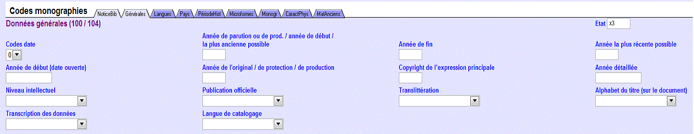

# Zone 100 : Données générales de traitement

## Descriptif

| Zone | Ind1 | Ind2 | Code de sous-zone | Position | Valeur | O/F | R/NR | Contenu |
| --- | --- | --- | --- | --- | --- | --- | --- | --- |
| 100 |  | # |  |  |  | O | NR | Données générales de traitement |
|  | 0 |  |  |  |  |  |  | Date certaine / Etat de publication certain pour les ressources continues |
|  | 1 |  |  |  |  |  |  | Date incertaine / Etat de publication incertain pour les ressources continues |
|  |  |  | a |  |  | O | NR | Année de parution ou de production / année de début / la plus ancienne possible |
|  |  |  | b |  |  | F | NR | Année de fin |
|  |  |  | c |  |  | F | NR | Année la plus récente possible |
|  |  |  | d |  |  | F | NR | Année de début (date ouverte) |
|  |  |  | e |  |  | F | NR | Année de l'original reproduit / année de protection / année de production |
|  |  |  | f |  |  | F | NR | Année du copyright de l'expression principale |
|  |  |  | g |  |  | F | NR | Année détaillée |
|  |  |  | h |  |  | F | NR | Année de fabrication |

Les informations figurant en couleur dans le tableau ne sont pas telles que définies dans le format Unimarc standard

Le terme de *parution* regroupe ici les notions de publication, de diffusion et de distribution.

## Commentaires

La zone **100** telle que définie dans le format de catalogage du Sudoc ne correspond qu'aux positions 8 à 16 de la sous-zone **100 $a** du format UNIMARC, "Code de date de publication, première et deuxième date de publication".

Ressources continues

Pour les **ressources continues**, les dates qui figurent ici sont les *dates de publication*.

Ce ne sont *ni les dates de recouvrement*, *ni les dates annoncées sur la page de titre* (annuaire paraissant l'année d'avant).

Pour une **publication en ligne**, ce sont les *dates de mise en ligne*.

Les informations correspondantes doivent être saisies dans l'onglet Générales de la grille de saisie des données codées :

Pour les ressources continues, la zone 100 étant une zone sous autorité de l'ISSN, avant toute modification se référer à la [procédure de demande de correction](https://documentation.abes.fr/sudoc/manuels/controle_bibliographique/circuit_signalement_rc/index.html#ProcedureDemandeCorrectionISSN ), puis effectuer, le cas échéant, une demande de correction dans [CIDEMIS](https://cidemis.sudoc.fr/)..

### Indication des dates

Toutes les sous-zones de la zone **100** doivent comporter au moins quatre caractères. Les deux premiers caractères sont obligatoirement numériques. Les deux derniers caractères peuvent être soit numériques, soit le caractère "X".

Dans tous les cas où le format UNIMARC préconise l'utilisation de blancs, ceux-ci doivent être, lors de la saisie dans le Sudoc, remplacés par un "X".

Dans tous les cas où le format UNIMARC préconise l'utilisation de "9999", cette suite ne doit pas être saisie par le catalogueur. Elle sera automatiquement restituée à l'échange.

### Principes généraux

Dans le Sudoc, il est obligatoire d'enregistrer dans la zone correspondant à la date de production ou de parution une date (ou une fourchette de dates) associée à la manifestation, même approximative.

La date enregistrée en 100 $a doit concorder avec la date retenue en [214](https://documentation.abes.fr/sudoc/formats/unmb/zones/214.htm) pour identifier la manifestation.

C'est la valeur de l'indicateur 1 qui détermine si la date de parution est certaine ou incertaine.

### Date certaine

1er indicateur = 0

A utiliser dans les cas où :

- Ressource continue : on sait de façon certaine si la ressource continue est en cours ou si elle a cessé.
- Monographie : on sait de façon certaine la ou les date(s) de parution ou de production de la manifestation.

### Ressource continue en cours

$a : année de parution ou de production / année de début / la plus ancienne possible : contient la date de départ ou celle de la période couverte par la publication si elle est différente.

$d : année de début (date ouverte) : contient la date de départ ou celle de la période couverte par la publication si elle est différente, suivie de "-..."

*Note* : correspond à UNIMARC standard, zone **100**, sous-zone $a, Position 8 = "a".

### Ressource continue ayant cessé de paraître

$a : année de parution ou de production de la manifestation / année de début / la plus ancienne possible : contient la date de départ de la publication ou celle de la période couverte par la publication si elle est différente.

$b : année de fin : contient la date de cessation de parution.

*Note* : correspond à UNIMARC standard, zone **100**, sous-zone $a, Position 8 = "b".

### Monographie complète lors de la parution ou de la production, ou parue dans les limites d'une année civile

Concerne les monographies en un ou en plusieurs volume(s), parues en une seule fois ou dans la même année civile.

$a : année de parution ou de production de la manifestation / année de début / la plus ancienne possible : contient la date de parution ou de production de la manifestation.

*Note* : correspond à UNIMARC standard, zone **100**, sous-zone $a, Position 8 = "d".

### Reproduction d'un document

Concerne les documents qui sont une reproduction, c'est-à-dire une édition en fac-similé, un reprint, une réimpression, une numérisation, une reproduction sous forme de microforme, etc. Si la reproduction est celle d'un périodique, ou si l'original ou la reproduction sont mis à disposition sur plusieurs années, l'année de départ de la reproduction ainsi que celle de la parution sont utilisées.

$a : année de parution ou de production / année de début / la plus ancienne possible : contient la date de parution de la reproduction.

$e : année de l'original reproduit / année de protection / année de production : contient la date de la manifestation reproduite.

*Note* : correspond à UNIMARC standard, zone **100**, sous-zone $a, Position 8 = "e".

### Monographie dont la parution ou la production s'étend sur plus d'un an

$a : année de parution ou de production / année de début / la plus ancienne possible : contient la date de départ de la parution ou de la production.

$b : année de fin : contient la date de fin de parution ou de production.

$d : Année de début (date ouverte) : contient la date de départ ou celle de la période couverte par la parution si elle est différente, suivie de "-...", dans le cas où la parution n'est pas terminée.

*Note* : correspond à UNIMARC standard, zone **100**, sous-zone $a, Position 8 = "g".

### Monographie ayant à la fois une date de parution et une date de copyright ou de privilège

La date de copyright ou la date de privilège peut être mentionnée à condition qu'elle identifie la date de l'expression principale*.

Un "privilège" est défini comme un monopole accordé, pour une durée déterminée, par un organisme gouvernemental à un auteur ou un libraire pour une édition.

$a : année de parution ou de production / année de début / la plus ancienne possible : contient la date de parution de la manifestation.

$f : année de copyright : contient la date de copyright ou de privilège de l'expression principale contenue dans la manifestation.

** C'est-à-dire sans tenir compte des « augmentations » telles que préface ou postface, commentaire ou apparat critique, illustrations, annexes, sous-titres optionnels (audiovisuel), bonus, contenu d'une brochure d'accompagnement, du manuel de l'utilisateur, etc.*

*Note* : correspond à UNIMARC standard, zone **100**, sous-zone $a, Position 8 = "h".

### Monographie ayant à la fois une date de parution et une date de production (audiovisuel) ou de protection (enregistrements sonores

Concerne les films, la musique, etc. lorsqu'il y a un écart entre la production/enregistrement et la distribution/version.

Voir AFNOR, Z 44-065, 4.1.1

« Le producteur de vidéogrammes est une personne physique ou personne morale qui a l'initiative et la responsabilité de la première fixation d'une séquence d'images animées. La société de production de films cinématographiques assure la bonne fin d'une oeuvre audiovisuelle sur le plan financier, technique et organisationnel ».

Voir AFNOR, Z 44-066, annexe B

« Producteur : personne physique ou morale qui a l'initiative et la responsabilité de la première fixation d'une séquence de sons (loi N) 85-660 du 3 juillet 1985, titre II, article 21. Cette définition est proche de celle fournie de [sic] la convention de Rome et dans la Convention de Genève.

Mention de protection : mention indiquant le titulaire des droits sur l'enregistrement sonore, et l'année de la première publication de cet enregistrement. Cette notion est propre aux phonogrammes. Elle est constituée de trois éléments : le symbole P ; l'indication de l'année de la première publication ; le nom du producteur et de son ayant-droit ».

$a : année de parution ou de production / année de début / la plus ancienne possible : contient la date de la parution de la ressource.

$e : année de l'original / de protection / de production : contient la date de protection (enregistrement sonore) ou de production (audiovisuel).

*Note* : correspond à UNIMARC standard, zone **100**, sous-zone $a, Position 8 = "i".

### Monographie avec date de parution ou de production détaillée

Concerne les documents pour lesquels il est important d'enregistrer le mois (et peut-être le jour) de la parution ou de la production de la manifestation.

$a : année de parution ou de production / année de début / la plus ancienne possible : contient l'année de publication.

$g : année détaillée : contient la date développée sous la forme "MMJJ", en complément du contenu de "année de début".

*Note* : correspond à UNIMARC standard, zone **100**, sous-zone $a, Position 8 = "j".

### Monographie ayant à la fois une date de publication et une date de diffusion/distribution (cas des enregistrements sonores)

Concerne les enregistrements sonores dans le cas où la date de publication et la date de diffusion/distribution diffèrent l'une de l'autre.

$a : année de parution ou de production / année de début / la plus ancienne possible : contient la date de publication de la manifestation.

### Monographie ayant à la fois une date de publication et une date d'impression (cas des livres anciens)

Dans le cas des livres anciens où il est fréquent qu'une date de publication diffère de la date de d'impression, il est recommandé d'enregistrer ces deux dates dans la zone 100.

Dans le cas de catalogage de livres modernes, cette recommandation n'est pas à appliquer.

$a : année de parution ou de production / année de début / la plus ancienne possible : contient l'année de publication de la manifestation.

$h : Année de fabrication : contient la date d'impression de la manifestation.

*Note* : correspond à UNIMARC standard, zone **100**, sous-zone $a, Position 8 = "k".

| Exemple : |
| --- |
| **100** 0#$a1548*$h1547* |
| **214** ##**$r**Lugduni, ad candentis Salamandræ insigne, in vico Mercenario, apud Sennetonios fratres. Anno 1548**$s**Lugduni, excudebat Benedictus Bonnyn impensis honestissimorum virorum Jacob. ac Joann. Senetoniorum fratrum, 1547 |
| *Document publié en 1548 et imprimé en 1547. Voir la sous-zone 214 ##$d.* |

La sous-zone $h doit être saisie en mode expert (désactiver la grille des données codées).

### Date de publication incertaine

1er indicateur = 1

A utiliser dans les cas où :

- Ressource continue : on ne sait pas si la ressource continue est en cours ou si elle a cessé de paraître.
- Monographie : : la date de publication de la manifestation est restituée.

L'utilisation de cet indicateur peut impliquer d'enregistrer une fourchette de dates, en utilisant les deux sous-zones appropriées ($a et $c).

### Ressource continue d'état inconnu

Concerne les ressources continues dont on ne sait pas si la publication est en cours ou si elle a cessé.

$a : année de publication / de parution / année de début / la plus ancienne possible : contient la date de départ de la ou, à défaut, de la parution de la manifestation, ou celle de la période couverte par la parution si elle est différente.

*Note* : correspond à UNIMARC standard, zone **100**, sous-zone $a, Position 8 = "c".

### Monographie, date de publication incertaine

$a : année de parution ou de production de la manifestation / année de début / la plus ancienne possible : contient la plus ancienne date possible de parution.

$c : année la plus récente possible. : contient la date de parution la plus tardive possible.

*Note* : correspond à UNIMARC standard, zone **100**, sous-zone $a, Position 8 = "f".
