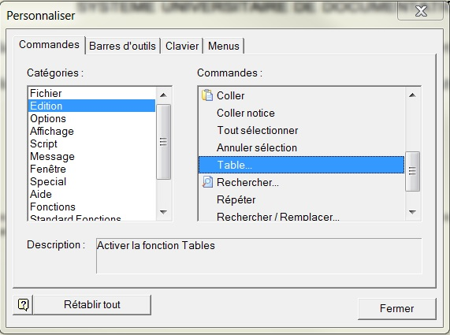
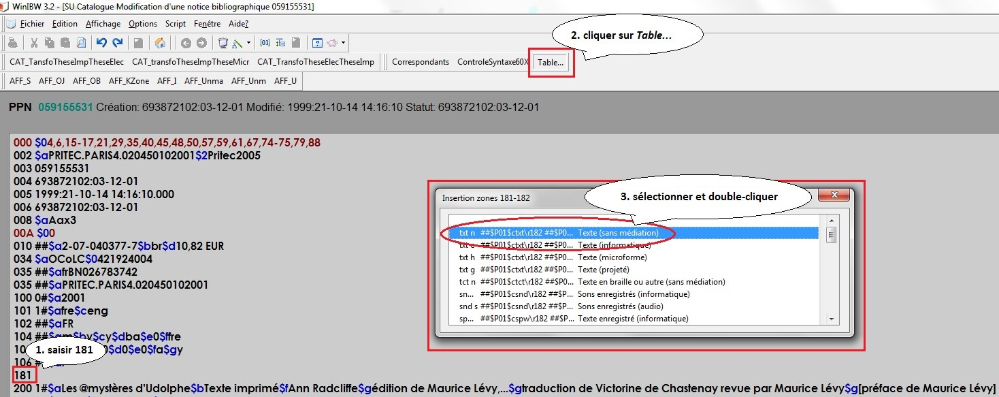
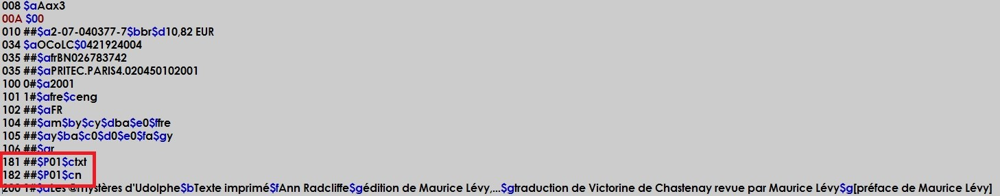
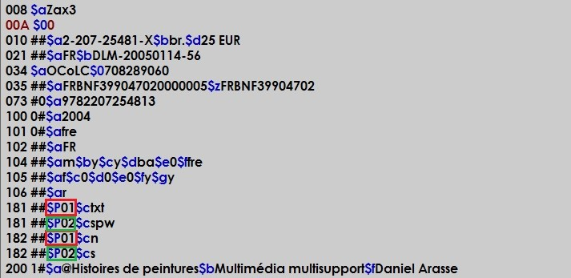

# Zones 181-182 : Type de contenu et type de médiation

## Descriptif

| Zone | Ind1 | Ind2 | Code de sous-zone | O/F | R/NR | Contenu | Table de valeurs associée |
| --- | --- | --- | --- | --- | --- | --- | --- |
| 181 | # | # |  | O | R | Zone de données codées : type de contenu |  |
|  |  |  | c | O | NR | Type de contenu | [(fichier Excel - voir l'onglet n° 2 : 181)](https://documentation.abes.fr/sudoc/autres/181182_TableauEtCombinaisons.xls)  [(fichier .pdf - 181)](https://documentation.abes.fr/sudoc/autres/181182_TableauEtCombinaisons_Onglet2_181.pdf) |
|  |  |  | P | O | NR | Donnée de lien entre zones |  |

| Zone | Ind1 | Ind2 | Code de sous-zone | O/F | R/NR | Contenu | Table de valeurs associée |
| --- | --- | --- | --- | --- | --- | --- | --- |
| 182 | # | # |  | O | R | Zone de données codées : type de médiation |  |
|  |  |  | c | O | NR | Type de médiation | [(fichier Excel - voir l'onglet n° 3 : 182)](https://documentation.abes.fr/sudoc/autres/181182_TableauEtCombinaisons.xls)  [(fichier .pdf - 182)](https://documentation.abes.fr/sudoc/autres/181182_TableauEtCombinaisons_Onglet3_182.pdf) |
|  |  |  | P | O | R | Donnée de lien entre zones |  |

Les informations figurant en couleur dans les tableaux ne sont pas telles que définies dans le format Unimarc standard

## Commentaires

|  | [1. Introduction](https://documentation.abes.fr/sudoc/formats/unmb/zones/182.htm#Introduction) |
| --- | --- |
|  | [2. Définitions](https://documentation.abes.fr/sudoc/formats/unmb/zones/182.htm#Definitions) |
|  | [3. Application au catalogage](https://documentation.abes.fr/sudoc/formats/unmb/zones/182.htm#ApplicationCatal) |

### 1. Introduction

A partir du 4 novembre 2014, les zones 181 et 182 se substituent à la sous-zone [200$b](https://documentation.abes.fr/sudoc/formats/unmb/zones/200.htm) désormais obsolète (et qui sera proscrite en catalogage, une fois toutes les modifications de masse effectuées par l'ABES). Elles s'utilisent donc dans tous les types de document, sans exception.

Voir le j.e-cours [Les zones UNIMARC 181 (type de contenu) et 182 (type de médiation)](https://callisto-formation.fr/course/view.php?id=662)

Dans *RDA-FR*, les éléments *3.51 Type de contenu* et *3.2 Type de médiation* permettent d'informer sur la **forme du contenu de la publication décrite** et sur le **type de médiation par laquelle on y accède**. Ils sont en correspondance avec la zone 0 de l'ISBD.

Ces éléments sont susceptibles d'**améliorer les tris** dans les résultats de recherche et donc d'optimiser les outils de consultation des catalogues, par exemple par le biais de facettes plus précises que ce que les données actuelles permettent.

### 2. Définitions

#### 2.1. Type de contenu (181)

##### 2.1.1. Défintion

Le type de contenu est une catégorisation reflétant la (ou les) forme(s) fondamentale(s) utilisée(s) pour exprimer le contenu d'une ressource, accompagnée si nécessaire de précisions sur le (ou les) sens sollicité(s), sur le nombre de dimensions spatiales restituées à la perception et/ou sur la présence ou l'absence de mouvement. (cf. *RDA-FR* 3.51.1.1)

##### 2.1.2. Vocabulaire

cf. *RDA-FR* 3.51.1. TABLEAU DES TYPES DE CONTENU

| données cartographiques | Contenu cartographique exprimé au moyen de données encodées numériquement, en vue d'un traitement par ordinateur. Comprend les systèmes d'information géographiques (SIG) qui permettent de créer, d'organiser et de présenter des données spatialement référencées (ou géoréférencées), mais aussi de produire des plans et des cartes.  Dans le cas de données cartographiques devant être perçues sous la forme d'image ou de forme tridimensionnelle, voir *image cartographique*, *image cartographique animée*, *image cartographique tactile*, *objet cartographique* et *objet cartographique tactile*. |
| --- | --- |
| données informatiques | Contenu exprimé au moyen de données encodées numériquement, en vue d'un traitement par ordinateur. Comprend les données numériques, les données sur l'environnement, etc. utilisées par des logiciels d'application pour calculer des moyennes, des corrélations, etc. ou bien utilisées pour produire des modèles, etc. mais qui, normalement, ne sont pas affichées sous leur forme brute.  Dans le cas de données devant être perçues visuellement sous la forme de notation, d'image, ou de forme tridimensionnelle, voir *forme tridimensionnelle, image animée bidimensionnelle, image animée tridimensionnelle, image fixe, mouvement noté, musique notée et texte*.  Dans le cas de données devant être perçues sous une forme audible, voir *musique exécutée, parole énoncée et sons*.  Dans le cas de données cartographiques, voir *données cartographiques*. |
| forme cartographique tridimensionnelle | Contenu cartographique exprimé au moyen d'une ou de plusieurs formes destinées à être perçues visuellement en trois dimensions. Comprend : les globes, les modèles en relief, etc. |
| forme cartographique tridimensionnelle tactile | Contenu cartographique exprimé au moyen d'une ou de plusieurs formes destinées à être perçues au toucher comme une ou plusieurs formes tridimensionnelles. |
| forme tridimensionnelle | Contenu exprimé au moyen d'une ou de formes destinées à être perçues visuellement en trois dimensions. Comprend les sculptures, les maquettes, les objets et spécimens naturels, les hologrammes, etc.  Dans le cas d'un contenu cartographique devant être perçu comme une forme tridimensionnelle, *voir forme cartographique tridimensionnelle*.  Dans le cas de formes tridimensionnelles devant être perçues au toucher, *voir forme tridimensionnelle tactile*. |
| forme tridimensionnelle tactile | Contenu exprimé au moyen d'une ou de plusieurs formes destinées à être perçues au toucher comme une ou plusieurs formes tridimensionnelles. |
| image animée bidimensionnelle | Contenu exprimé au moyen d'images destinées à être perçues comme animées en deux dimensions. Comprend les films cinématographiques (avec prise de vue en direct et/ou animation), les enregistrements sur film ou vidéo de spectacles, d'événements, etc., les jeux vidéo, etc., différents de ceux devant être perçus en trois dimensions (voir *image animée tridimensionnelle*). Les images animées peuvent ou non être accompagnées de son.  Dans le cas d'un contenu cartographique devant être perçu comme une image animée bidimensionnelle, voir *image cartographique animée*. |
| image animée tridimensionnelle | Contenu exprimé au moyen d'images destinées à être perçues comme animées en trois dimensions. Comprend les films en 3-D (avec prise de vue en direct et/ou animation), les jeux vidéo en 3-D, etc. Les images animées tridimensionnelles peuvent ou non être accompagnées de son. |
| image cartographique | Contenu cartographique exprimé au moyen de lignes, contours, estompage, etc. destinés à être perçus visuellement comme une ou plusieurs images fixes en deux dimensions. Comprend les cartes, les vues, les atlas, les images de télédétection, etc. |
| image cartographique animée | Contenu cartographique exprimé au moyen d'images destinées à être perçues comme animées en deux dimensions. Comprend les images satellite de la Terre ou d'autres corps célestes en mouvement. |
| image cartographique tactile | Contenu cartographique exprimé au moyen de lignes, contours et/ou d'autres formes destinés à être perçus au toucher comme une image fixe en deux dimensions. |
| image fixe | Contenu exprimé au moyen de lignes, contours, estompage, etc. destinés à être perçus visuellement en deux dimensions. Comprend les dessins, les peintures, les diagrammes, les images photographiques (fixes), etc.  Dans le cas d'un contenu cartographique devant être perçu comme une image bidimensionnelle, voir *image cartographique*.  Dans le cas d'images devant être perçues au toucher, voir *image tactile*. |
| image tactile | Contenu exprimé au moyen de lignes, contours et/ou d'autres formes destinés à être perçus au toucher comme une image fixe en deux dimensions. |
| mouvement noté | Contenu exprimé au moyen d'une forme de notation du mouvement destinée à être perçue visuellement. Comprend toutes les formes de notation du mouvement différentes de celles devant être perçues au toucher (voir *mouvement noté tactile*). |
| mouvement noté tactile | Contenu exprimé au moyen d'une forme de notation du mouvement destinée à être perçue au toucher. |
| musique exécutée | Contenu exprimé au moyen de musique sous une forme audible. Comprend les exécutions de musique enregistrées, la musique créée par ordinateur, etc. |
| musique notée | Contenu exprimé au moyen d'une forme de notation de la musique destinée à être perçue visuellement. Comprend toutes les formes de notation de la musique différentes de celles devant être perçues au toucher (voir *musique notée tactile*). |
| musique notée tactile | Contenu exprimé au moyen d'une forme de notation musicale destinée à être perçue au toucher. Comprend la musique en braille et les autres formes tactiles de notation musicale. |
| parole énoncée | Contenu exprimé au moyen du langage sous une forme audible. Comprend les lectures enregistrées, les récitations, les discours, les entretiens, les récits oraux, etc., la parole créée par ordinateur, etc. |
| programme informatique | Contenu exprimé au moyen d'instructions encodées numériquement, en vue d'un traitement et d'une exécution par ordinateur. Comprend les systèmes d'exploitation, les logiciels d'application, etc. |
| sons | Contenu, différent du langage ou de la musique, exprimé sous une forme audible. Comprend les sons naturels, les sons artificiellement produits, etc. |
| texte | Contenu exprimé au moyen d'une forme de notation du langage destinée à être perçue visuellement. Comprend toutes les formes de notation du langage différentes de celles devant être perçues au toucher (voir *texte tactile*). |
| texte tactile | Contenu exprimé au moyen d'une forme de notation du langage destinée à être perçue au toucher. Comprend les textes en braille et les autres formes tactiles de notation du langage. |

#### 2.2. Type de médiation (182)

##### 2.2.1. Défintion

Le type de médiation est une catégorisation indiquant le type général de dispositif de médiation requis pour visionner, faire fonctionner, faire défiler, etc. le contenu d'une ressource. (cf *RDA-FR* 3.2.1.1)

##### 2.2.2. Vocabulaire

cf. *RDA-FR* 3.2. TABLEAU DES TYPES DE MÉDIATION

| audio | *Pour des ressources nécessitant un lecteur audio.*   Type de médiation s'appliquant aux ressources contenant du son enregistré et conçues pour une utilisation au moyen d'un dispositif de lecture tel qu'une platine, un lecteur de cassette audio, un lecteur de CD ou un lecteur MP3. S'applique aux ressources contenant du son analogique aussi bien que du son encodé numériquement. Pour les ressources sur support matériel (par exemple, un CD audio), n'indiquer que le type de médiation audio. Pour des fichiers dématérialisés (par exemple, un fichier MP3), indiquer les deux types de médiation électronique et audio. |
| --- | --- |
| électronique | *Pour des ressources nécessitant un appareil informatique.*   Type de médiation s'appliquant aux ressources composées de fichiers électroniques et conçues pour une utilisation au moyen d'un appareil informatique (par exemple, ordinateur, tablette, console de jeux, etc.). S'applique aux ressources accessibles à distance par serveur aussi bien qu'aux ressources en accès direct telles que des bandes et des disques informatiques. |
| microforme | *Pour des ressources nécessitant un lecteur de microforme.*   Type de médiation s'appliquant aux ressources composées d'images de taille réduite non lisibles à l'oeil nu, et conçues pour une utilisation au moyen d'un dispositif tel qu'un lecteur de microfilm ou de microfiche. S'applique aux ressources produites selon les deux procédés micrographiques, transparent et opaque. |
| microscopique | *Pour des ressources nécessitant un microscope.*   Type de médiation s'appliquant aux ressources contenant des objets minuscules et conçues pour une utilisation au moyen d'un dispositif tel qu'un microscope, pour faire apparaître des détails invisibles à l'oeil nu. |
| projeté | *Pour des ressources nécessitant un projecteur.*   Type de médiation s'appliquant aux ressources conçues pour une utilisation au moyen d'un dispositif de projection tel qu'un projecteur de film cinématographique, un projecteur de diapositives ou un rétroprojecteur. S'applique à toute ressource conçue pour être projetée sous la forme d'images bidimensionnelles ou tridimensionnelles.  Pour des fichiers dématérialisés (par exemple, un fichier DCP utilisé pour la projection de films en salle), indiquer les deux types de médiation électronique et projeté. |
| sans médiation | *Pour des ressources ne nécessitant aucun dispositif de médiation.*   Type de médiation s'appliquant aux ressources dont le contenu est conçu pour être perçu directement par un ou plusieurs sens humains sans l'aide d'un dispositif de médiation.  S'applique à toute ressource au contenu visuel et/ou tactile produit selon des procédés tels que l'impression, la gravure, la lithographie, la photographie négative, etc. ; l'embossage, la texturation, etc ; ou bien encore au moyen de l'écriture à la main, du dessin, de la peinture, etc. S'applique également aux ressources constituées de formes tridimensionnelles telles que sculptures, maquettes, etc. |
| stéréoscopique | *Pour des ressources nécessitant un stéréoscope.*   Type de médiation s'appliquant aux ressources composées de paires d'images fixes et conçues pour une utilisation au moyen d'un dispositif tel qu'un stéréoscope ou une visionneuse stéréoscopique pour donner l'impression des trois dimensions. |
| vidéo | *Pour des ressources nécessitant un lecteur vidéo.*   Type de médiation s'appliquant aux ressources contenant des images animées ou fixes et conçues pour une utilisation au moyen d'un dispositif de lecture tel qu'un lecteur de cassette vidéo ou de DVD. S'applique aux ressources contenant des images encodées numériquement aussi bien que des images analogiques. Pour les ressources sur support matériel (par exemple, un DVD vidéo), n'indiquer que le type de médiation vidéo. Pour des fichiers dématérialisés (par exemple, un fichier MP4), indiquer les deux types de médiation électronique et vidéo. |

### 3. Application au catalogage

Le vocabulaire de référence pour ces deux nouvelles zones est contrôlé par une liste fermée de valeurs.

La saisie des zones 181 et 182 peut s'effectuer dans WinIBW :

- soit de manière traditionnelle par saisie des codes (ou par copier/coller des valeurs de la liste fermée de valeurs issues de RDA combinées entre elles ([(fichier Excel - voir l'onglet n° 1 : 181-182)](https://documentation.abes.fr/sudoc/autres/181182_TableauEtCombinaisons.xlsx)) ou [(fichier .pdf - 181-182)](https://documentation.abes.fr/sudoc/autres/181182_TableauEtCombinaisons_Onglet1.pdf) ;

- soit au moyen d'une nouvelle commande **Table...** à installer par glisser-coller dans la barre des boutons :

Les combinaisons accessibles par le bouton *Table...* sont les seules autorisées dans le Sudoc.

Il est néanmoins possible, à condition d'effectuer une saisie manuelle, d'utiliser la valeur *autre* dans chacune des 2 zones si aucune des valeurs proposées par le bouton *Table...* ne s'applique à la ressource décrite.

Modalités de saisie des zones 181 et 182 :

1. en mode modification saisir une zone 181 ;

2. cliquer sur le bouton *Table...* : une pop-up contenant la liste des combinaisons de valeurs autorisées dans le Sudoc s'ouvre ;

3. sélectionner le couple de valeurs correspondant au document décrit et double-cliquer.

Renouveler cette suite d'opérations si la ressource décrite nécessite plusieurs couples de valeurs.

ATTENTION : l'utilisation du bouton *Table...* génère toujours un $P01. Lorsqu'il est nécessaire de créer plusieurs couples de 181-182, ne pas oublier d'incrémenter le numéro d'appariement pour chacun des nouveaux couples.

Distinction entre imprimé et manuscrit

Le mode de production (distinction entre imprimé et manuscrit) se note dans la zone 106 ($ah pour manuscrit, $ar ou plus rarement $aj pour imprimé) et dans la zone 008, position 1.

Multimédia multisupport :

La notion de « multimédia multisupport » telle que mentionnée en 200$b n'a pas de correspondance en 181-182. Si la ressource présente plusieurs types de contenu et/ou de média, on doit les enregistrer tous dans autant de couples 181-182 que nécessaires. Toutefois on doit continuer de décrire ce type de ressource dans une notice de type multimédia (008 $aZ).

Attention, la présence de plusieurs couples 181-182 dans une même notice n'induit pas forcément une notice de type multimédia (008 $aZ) (voir par exemple les bandes dessinées ou certains atlas).

[Cf. exemple](https://documentation.abes.fr/sudoc/formats/unmb/zones/182.htm#MultiMedTxtImpTxtEnreg)

Matériel d'accompagnement :

Le matériel d'accompagnement n'est pas concerné par ces zones. Seule la ressource principale doit être prise en compte.

[Cf. exemple](https://documentation.abes.fr/sudoc/formats/unmb/zones/182.htm#TxtImprMatAccomp)

## Exemples

|  | [Texte manuscrit](https://documentation.abes.fr/sudoc/formats/unmb/zones/182.htm#TxtMss) |
| --- | --- |
|  | [Texte imprimé](https://documentation.abes.fr/sudoc/formats/unmb/zones/182.htm#TxtImpr) |
|  | [Texte imprimé avec matériel d'accompagnement](https://documentation.abes.fr/sudoc/formats/unmb/zones/182.htm#TxtImprMatAccomp) |
|  | [Texte électronique](https://documentation.abes.fr/sudoc/formats/unmb/zones/182.htm#TxtElec) |
|  | [Périodique électronique](https://documentation.abes.fr/sudoc/formats/unmb/zones/182.htm#PerioElec) |
|  | [Collection imprimée d'albums pour enfants](https://documentation.abes.fr/sudoc/formats/unmb/zones/182.htm#CollecImprAlbums) |
|  | [Bande dessinée](https://documentation.abes.fr/sudoc/formats/unmb/zones/182.htm#BD) |
|  | [Livre d'art](https://documentation.abes.fr/sudoc/formats/unmb/zones/182.htm#Art) |
|  | [Livre d'art : catalogue d'exposition](https://documentation.abes.fr/sudoc/formats/unmb/zones/182.htm#ArtCatalogue) |
|  | [Livre d'art : monographie d'artiste](https://documentation.abes.fr/sudoc/formats/unmb/zones/182.htm#ArtMonographie) |
|  | [Carte et atlas](https://documentation.abes.fr/sudoc/formats/unmb/zones/182.htm#CarteAtlas) |
|  | [Film sur DVD](https://documentation.abes.fr/sudoc/formats/unmb/zones/182.htm#FilmDVD) |
|  | [Enregistrement sonore non musical, non textuel](https://documentation.abes.fr/sudoc/formats/unmb/zones/182.htm#EnregSonNonMusNonTxt) |
|  | [Enregistrement sonore textuel](https://documentation.abes.fr/sudoc/formats/unmb/zones/182.htm#EnregSonTxt) |
|  | [Enregistrement sonore musical](https://documentation.abes.fr/sudoc/formats/unmb/zones/182.htm#EnregSonMus) |
|  | [Multimédia multisupport contenant du texte imprimé et du texte enregistré](https://documentation.abes.fr/sudoc/formats/unmb/zones/182.htm#MultiMedTxtImpTxtEnreg) |

Texte manuscrit

| Unimarc : | **008** **$a**Aax3 |
| --- | --- |
|  | [...] |
|  | **106**##*$ah* |
|  | [...] |
|  | **181**##**$P**01**$c***txt* |
|  | **182**##**$P**01**$c***n* |
|  | **200**1#**$a**@Recueil de différentes questions de droit arrangées selon l'ordre des Institutes de Justinien qui ont fait la matiere des conférences de plusieurs jeunes avocats à Toulouse l'an 1781 |
|  | [...] |
|  | **215**##**$a**227 feuillets**$d**235 x 175 mm |
|  | [...] |
|  | **316**##**$a**Reliure parchemin, 18e siècle, dos à nerfs, liens en toile |
|  | **317**##**$a**Ex-libris ms sur la dernière page "Ex libris Sezier" [?] ; note ms sur la page de garde |
| ISBD : | *Texte (visuel)* |
|  | Recueil de différentes questions de droit arrangées selon l'ordre des Institutes de Justinien qui ont fait la matiere des conférences de plusieurs jeunes avocats à Toulouse l'an 1781. - [Toulouse], 1781. - 227 f. ; 235 x 175 mm. |
| Affichage U/public |  |
| *Type(s) de contenu (modes de consultation) :* | *Texte* |
| Titre : | Recueil de différentes questions de droit arrangées selon l'ordre des Institutes de Justinien qui ont fait la matiere des conférences de plusieurs jeunes avocats à Toulouse l'an 1781 |
| Commentaire : | Les valeurs associées aux zones 181 et 182 permettent seulement de préciser qu'il s'agit d'un texte visuel sans médiation. Il est donc nécessaire de compléter ces données avec la sous-zone **106 $a** (valeur **h = manuscrit**).  *Note* : ATTENTION : le signalement des manuscrits dans le Sudoc obéit à un strict périmètre. Voir [la fiche de description générale des manuscrits.](https://documentation.abes.fr/sudoc/regles/Catalogage/Regles__Fa_TexteManuscrit.htm) |

Texte imprimé

| Unimarc : | **008** **$a**Aax3 |
| --- | --- |
|  | [...] |
|  | **181**##**$P**01**$c***txt* |
|  | **182**##**$P**01**$c***n* |
|  | **200**1#**$a**Les @mystères d'Udolphe‎**$f**Ann Radcliffe**$g**édition de Maurice Lévy,...**$g**traduction de Victorine de Chastenay revue par Maurice Lévy**$g**[préface de Maurice Lévy] |
|  | [...] |
|  | **215**##**$a**1 volume (905 pages)**$c**couverture illustrée en couleurs**$d**18 cm |
| ISBD : | *Texte (visuel)* |
|  | Les mystères d'Udolphe / Ann Radcliffe ; édition de Maurice Lévy,... ; traduction de Victorine de Chastenay revue par Maurice Lévy ; [préface de Maurice Lévy]. - Paris : Gallimard, 2001. - 1 vol. (905 p.) : couv. ill. en coul. ; 18 cm. |
| Affichage U/public |  |
| *Type(s) de contenu (modes de consultation) :* | *Texte* |
| Titre : | Les mystères d'Udolphe / Ann Radcliffe ; édition de Maurice Lévy,... ; traduction de Victorine de Chastenay revue par Maurice Lévy ; [préface de Maurice Lévy] |
| Auteur(s) : | Radcliffe, Ann (1764-1823). Auteur |
| Commentaire : | On ne respecte pas complètement l'affichage ISBD. Si c'était le cas on aurait *Texte (visuel) : immédiat* |

Texte imprimé avec matériel d'accompagnement

| Unimarc : | **008** **$a**Aax3 |
| --- | --- |
|  | [...] |
|  | **181** ##**$P**01**$c***txt* |
|  | **182**##**$P**01**$c***n* |
|  | **200**1#**$a**@Berlin‎**$e**city guide**$f**Andrea Schulte-Peevers |
|  | [...] |
|  | **215**##**$a**1 volume (340 pages)**$c**illustrations**$d**20 cm**$e**with pull-out map |
| ISBD : | *Texte (visuel)* |
|  | Berlin: city guide / Andrea Schulte-Peevers. - 7th ed. - Footscray, Vic. (Australie) ; London : Lonely Planet, 2011. - 1 vol. (340 p.) : ill. ; 20 cm + with pull-out map. |
| Affichage U/public |  |
| *Type(s) de contenu (modes de consultation) :* | *Texte* |
| Titre : | Berlin : city guide / Andrea Schulte-Peevers. - 7th ed. |
| Auteur(s) : | Schulte-Peevers, Andrea. Auteur |
| Commentaire : | Le matériel d'accompagnement, ici une carte détachable, n'est pas pris en compte comme type de contenu individuel |

Texte électronique

| Unimarc : | **008** **$a**Oax3 |
| --- | --- |
|  | [...] |
|  | **181**##**$P**01**$c***txt* |
|  | **182**##**$P**01**$c***c* |
|  | **200**1#**$a**@M. Tullii Ciceronis De natura deorum libri tres.**$e**Cum notis integris Paulli Manucii, Petri Victorii, Joachimi Camerarii, Dionys. Lambini, et Fulv. Ursini. Recensuit, suisque animadversionibus illustravit ac emaculavit Joannes Davisius, L.L.D. Coll. regin. cantab. magister, & canonicus elienis. Accedunt emendationes Cl. Joannes Walkeri, A.M. Coll. trin. socii**$f**Cicero, Marcus Tullius |
| ISBD : | *Texte (visuel) : informatique* |
|  | M. Tullii Ciceronis De natura deorum libri tres. : Cum notis integris Paulli Manucii, Petri Victorii, Joachimi Camerarii, Dionys. Lambini, et Fulv. Ursini. Recensuit, suisque animadversionibus illustravit ac emaculavit Joannes Davisius, L.L.D. Coll. regin. cantab. magister, & canonicus elienis. Accedunt emendationes Cl. Joannes Walkeri, A.M. Coll. trin. socii / Cicero, Marcus Tullius. - [Farmington Hills, Mich] : Cengage Gale, 2009. |
| Affichage U/public |  |
| *Type(s) de contenu (modes de consultation) :* | *Texte (informatique)* |
| Titre : | M. Tullii Ciceronis De natura deorum libri tres. : Cum notis integris Paulli Manucii, Petri Victorii, Joachimi Camerarii, Dionys. Lambini, et Fulv. Ursini. Recensuit, suisque animadversionibus illustravit ac emaculavit Joannes Davisius, L.L.D. Coll. regin. cantab. magister, & canonicus elienis. Accedunt emendationes Cl. Joannes Walkeri, A.M. Coll. trin. socii / Cicero, Marcus Tullius |
| Auteur(s) : | Cicéron (0106-0043 av. J.-C.). Auteur |

Périodique électronique

| Unimarc : | **008** **$a**Obx3 |
| --- | --- |
|  | **011** ##‎**$a**2119-9655‎ |
|  | [...] |
|  | **181**##**$P***01***$c***txt* |
|  | **182** ##**$P***01***$c***c* |
|  | **183**##**$P**01**$a**ceb |
|  | **200**1#**$a**@Modes pratiques‎**$e**revue d'histoire du vêtement et de la mode**‎$f**École Duperré Paris ; IRHiS Institut de recherches historiques du Septentrion**‎$g**[responsable de publication Alain Soreil] |
|  | **214** #0**‎$a**Paris**‎$c**École Duperré‎**$d**2021- |
| ISBD : | *Texte (visuel) : informatique* |
|  | Modes pratiques : revue d'histoire du vêtement et de la mode / École Duperré Paris ; IRHiS Institut de recherches historiques du Septentrion ; [responsable de publication Alain Soreil]. - Paris : École Duperré, 2021- […]   ISSN 2119-9655 |
| Affichage U/public |  |
| *Type(s) de contenu (modes de consultation) :* | *Texte (informatique)* |
| Titre : | Histoires de peintures / Daniel Arasse |
| Auteur(s) : | Modes pratiques : revue d'histoire du vêtement et de la mode / École Duperré Paris ; IRHiS Institut de recherches historiques du Septentrion ; [responsable de publication Alain Soreil] |
| Publication : | Paris : École Duperré, 2021- |
| ISSN : | 2119-9655 |

Collection imprimée d'albums pour enfants

| Unimarc : | **008** **$a**Adx3 |
| --- | --- |
|  | **011** ##‎**$a**1625-0524**‎$f**1625-0524 |
|  | [...] |
|  | **181**##**$P***01***$c***txt* |
|  | **181** ##**$P***02***$c***sti* |
|  | **182**##**$P***01***$P***02***$c***n* |
|  | **183**##**$P**01**$P**02**$a**nga |
|  | **200**1#**$a**Les @P'tits albums |
|  | **326** ##**‎$a**collection |
| ISBD : | *Texte (visuel) + Image (fixe ; bidimensionnelle ; visuelle)* |
|  | Les p'tits albums. – [Paris] : Père Castor-Flammarion,2001- . - collection |
| Affichage U/public |  |
| *Type(s) de contenu (modes de consultation) :* | *Texte* |
| *Type(s) de contenu (modes de consultation) :* | *Image fixe* |
| Titre : | Les p'tits albums |
| Editeur(s) : | [Paris]‎ : Père Castor-Flammarion‎, 2001- |
| Notes : | collection |

Bande dessinée

| Unimarc : | **008** **$a**Aax3 |
| --- | --- |
|  | [...] |
|  | **105** ##**$a**a*$bt***$c**0**$d**0**$e**0**$f**a**$g**d |
|  | [...] |
|  | **181** ##**$P***01***$c***txt* |
|  | **181**##**$P***02***$c***sti* |
|  | **182**##**$P***01***$P***02***$c***n* |
|  | **200**1#**$a**@Moi, René Tardi, prisonnier de guerre au Stalag IIB**$f**Tardi**$g**couleurs, Rachel Tardi |
|  | [...] |
|  | **215**##**$a**1 volume (188 pages)**$c**tout illustré en noir et couleurs, couverture illustrée en couleurs**$d**32 cm |
| ISBD : | *Texte (visuel) + Image (fixe ; bidimensionnelle ; visuelle)* |
|  | Moi, René Tardi, prisonnier de guerre au Stalag IIB / Tardi ; couleurs, Rachel Tardi. - [Bruxelles] : Casterman, impr. 2012. - 1 vol. (188 p.) : tout ill. en noir et coul., couv. ill. en coul. ; 32 cm. |
| Affichage U/public |  |
| *Type(s) de contenu (modes de consultation) :* | *Texte* |
|  | *Image fixe* |
| Titre : | Moi, René Tardi, prisonnier de guerre au Stalag IIB / Tardi ; couleurs, Rachel Tardi |
| Auteur(s) : | Tardi, Jacques (1946-....). Auteur |
|  | Tardi, Rachel. Technicien graphique |
| Commentaire : | Les zones 181 et 182 étant répétables, elles permettent de caractériser au mieux les différentes formes de la ressource. Le même traitement doit être appliqué à toute ressource mêlant texte et image à condition que les deux soient d'importance analogue (exemple : albums pour enfants, albums de photographies, catalogues d'exposition, etc...)  *Note :* la sous-zone **105 $b** (valeur **t = bande dessinée**) permet d'expliciter la nature du contenu de la ressource décrite. |

Livre d'art

| Unimarc : | **008** **$a**Aax3 |
| --- | --- |
|  | [...] |
|  | **181** ##**$P***01***$c***txt* |
|  | **182**##**$P***01***$c***n* |
|  | **200**1#**$a**@Histoires de peintures**$f**Daniel Arasse**$g**préfaces de Bernard Comment et Catherine Bédard |
|  | [...] |
|  | **215**##**$a**1 volume (360 page-[24] pages de planches)**$c**illustrations en couleurs, couverture ilustrée en couleurs.**$d**18 cm |
| ISBD : | *Texte (visuel)* |
|  | Histoires de peintures / Daniel Arasse ; préfaces de Bernard Comment et Catherine Bédard. - [Paris] : Gallimard, DL 2006, cop. 2004. - 1 volume (360 pages.-[24] pages de planches) : illustrations. en couleurs, couverture illustrée en couleurs ; 18 cm. |
| Affichage U/public |  |
| *Type(s) de contenu (modes de consultation) :* | *Texte* |
| Titre : | Histoires de peintures / Daniel Arasse ; préfaces de Bernard Comment et Catherine Bédard |
| Auteur(s) : | Arasse, Daniel (1944-2003). Auteur |
|  | Comment, Bernard (1960-...). Préfacier, etc. |
|  | Bédard, Catherine. Préfacier, etc. |
| Commentaire : | Ce document relève de RDA-FR 3.51.1.3.2.2 : Ressource constituée de plusieurs types de contenu d'importance inégale : il est constitué de 360 pages de texte et 24 pages de planches hors-texte contenant des reproductions de peinture. L'illustration est considérée comme marginale. |

| Unimarc : | **008** **$a**Aax3 |
| --- | --- |
|  | [...] |
|  | **181**##**$P***01***$c***txt* |
|  | **181**##**$P***02***$c***sti* |
|  | **182**##**$P***01***$P***02***$c***n* |
|  | **200**1#**$a**@Histoire de l'art**$f**E. H. Gombrich**$g**[traduit de l'anglais par J. Combe, C. Lauriol et D. Collins] |
|  | [...] |
|  | **215**##**$a**1 volume (1046 pages]**$c**illustrations en couleurs**$d**20 cm |
| ISBD : | *Texte (visuel) + Image (fixe ; bidimensionnelle ; visuelle)* |
|  | Histoire de l'art / E. H. Gombrich ; [traduit de l'anglais par J. Combe, C. Lauriol et D. Collins]. - Édition de poche. - Paris : Phaidon, DL 2006, cop. 1997. - 1 vol. (1046 p.) ; 20 cm. |
| Affichage U/public |  |
| *Type(s) de contenu (modes de consultation) :* | *Texte* |
| *Type(s) de contenu (modes de consultation) :* | *Image fixe* |
| Titre : | Histoire de l'art / E. H. Gombrich ; [traduit de l'anglais par J. Combe, C. Lauriol et D. Collins]. - Édition de poche |
| Auteur(s) : | Gombrich, Ernst Hans (1909-2001). Auteur |
|  | Combe, Jacques (19..-1993). Traducteur |
|  | Lauriol, Claude (1923-2015). Traducteur |
|  | Collins, Dennis (1951-....). Traducteur |
| Commentaire : | Ce document relève de RDA-FR 3.51.1.3.2.1 : Ressource constituée de plusieurs types de contenu d'égale importance : il est constitué de 503 pages de texte, d'une centaine de pages d'annexes et de 413 pages de planches de reproductions de peintures ou de photographies de sculptures ou d'architecture. Le texte et l'illustration sont considérés comme d'égale importance. |

| Unimarc : | **008** **$a**Aax3 |
| --- | --- |
|  | [...] |
|  | **181**##**$P***01***$c***txt* |
|  | **181**##**$P***02***$c***sti* |
|  | **182**##**$P***01***$P***02***$c***n* |
|  | **200**1#**$a**L'@oeil photographique de Daniel Arasse**$e**théories et pratiques d'un regard**$f**Pauline Martin et Magdalena Parise |
|  | [...] |
|  | **215**##**$a**1 volume (81-[7] pages]**$c**illustrations en couleurs, couverture illustrée en couleurs**$d**20 cm |
| ISBD : | *Texte (visuel) + Image (fixe ; bidimensionnelle ; visuelle)* |
|  | L'oeil photographique de Daniel Arasse : théories et pratiques d'un regard / Pauline Martin et Magdalena Parise. - Lyon : Fage, cop. 2012. - 1 vol. (81-[7] p.] : ill. en coul., couv. ill. en coul. ; 20 cm. |
| Affichage U/public |  |
| *Type(s) de contenu (modes de consultation) :* | *Texte* |
| *Type(s) de contenu (modes de consultation) :* | *Image fixe* |
| Titre : | L'oeil photographique de Daniel Arasse : théories et pratiques d'un regard / Pauline Martin et Magdalena Parise |
| Auteur(s) : | Martin, Pauline (1979-....). Auteur |
|  | Parise, Maddalena (19..-....). Auteur |
| Commentaire : | Ce document relève de RDA-FR 3.51.1.3.2.1 : Ressource constituée de plusieurs types de contenu d'égale importance : l'importance numéraire des illustrations égale celle du texte.  D'autre part, le sujet lui-même appuie cette appréciation (cf. 4e de couv.) : « le dispositif photographique » qui contribue à « forger la vision et la pratique de l'image pour l'historien de l'art » et qui permet au lecteur de découvrir « l'usage personnel que Daniel Arasse faisait de la photographie (...). » |

Livre d'art : catalogue d'exposition

| Unimarc : | **008** **$a***Aa*x3 |
| --- | --- |
|  | [...] |
|  | **181**##**$P***01***$c***sti* |
|  | **182**##**$P***01***$c***n* |
|  | **200**1#**$a**@Voyages italiens**$e**[exposition, Maison européenne de la photographie, Paris, 4 février-5 avril 2015]**$f**[photographies de] Bernard Plossu |
|  | [...] |
|  | **215**##**$a**volume (207 pages)**$c**illustrations en noir et en coulerus, couverture illustrée en couleurs**$d**25 cm |
| ISBD : | *Image fixe (visuel)* |
|  | Voyages italiens : [exposition, Maison européenne de la photographie, Paris, 4 février-5 avril 2015] / [photographies de] Bernard Plossu. - Paris : Editions Xavier Barral, DL 2015, cop. 2015. - 1 vol. (207 p.) : ill. en noir et en coul. ; 25 cm. |
| Affichage U/public |  |
| *Type(s) de contenu (modes de consultation) :* | *Image fixe* |
| Titre : | Voyages italiens : [exposition, Maison européenne de la photographie, Paris, 4 février-5 avril 2015] / [photographies de] Bernard Plossu |
| Auteur(s) : | Plossu, Bernard (1945-....). Photographe. |
| Commentaire : | Ce document relève de RDA-FR 3.51.1.3.2.2 : Ressource constituée de plusieurs types de contenu d'importance inégale : il est constitué essentiellement de photographies, accompagnées de 5 pages de texte. Le texte est considéré comme marginal.  Il s'agit cependant bien d'une monographie imprimée ; on emploie donc le code Aa dans la zone 008. ATTENTION : on ne peut pas utiliser la zone 116 Zone de données codées : ressources graphiques dans une notice Aa. Mais c'est normal car ces donénes codées sont relatives aux documents graphiques non projetables tels que définis par l'ISBD (NBM), c'est à dire des "non-livres". Cf. UNIMARC. Et ce n'est pas très grave dans la mesure où il n'y a pas de données codées correspondantes au cas "livre d'art contenant quasi exclusimvement des images" |

| Unimarc : | **008** **$a**Aax3 |
| --- | --- |
|  | [...] |
|  | **181**##**$P***01***$c***txt* |
|  | **181**##**$P***02***$c***sti* |
|  | **182**##**$P***01***$P***02***$c***n* |
|  | **200**1#**$a**@Doré**$e**l'imaginaire au pouvoir**$e**[exposition, Paris, Musée d'Orsay, 18 février-11 mai 2014 ; Ottawa, Musée des beaux-arts du Canada, 13 juin -14 septembre 2014]**$f**[catalogue] sous la direction de Philippe Kaenel**$g**[textes par Erika Dolphin, David Kunzle, David Skilton... [et al.]**$g**préface par Guy Cogeval et Marc Mayer**$g**traduction par Laetitia Itturalde, Anne-Marie Terel] |
|  | [...] |
|  | **215** ##**$a**a1 volume (335 pages)**$c**cillustrations en noir et couleurs, portraits, couverture illustrée**$d**31 cm |
| ISBD : | *Texte (visuel) + Image (fixe ; bidimensionnelle ; visuelle)* |
|  | Doré : l'imaginaire au pouvoir : [exposition, Paris, Musée d'Orsay, 18 février-11 mai 2014 ; Ottawa, Musée des beaux-arts du Canada, 13 juin -14 septembre 2014] / [catalogue] sous la direction de Philippe Kaenel ; [textes par Erika Dolphin, David Kunzle, David Skilton... [et al.] ; préface par Guy Cogeval et Marc Mayer ; traduction par Laetitia Itturalde, Anne-Marie Terel]. - Paris : Musée d'Orsay : Flammarion ; Ottawa : Musée des beaux-arts du Canada, impr. 2014, cop. 2014. - 1 vol. (335 p.) : ill. en noir et coul., portr., couv. ill. ; 31 cm. - Contient des textes traduits de l'anglais. - Titre de couv. : "Gustave Doré : l'imaginaire au pouvoir". - Bibliogr. p. 329-331. Notes bibliogr. Index. |
| Affichage U/public |  |
| *Type(s) de contenu (modes de consultation) :* | *Texte* |
| *Type(s) de contenu (modes de consultation) :* | *Image fixe* |
| Titre : | Doré : l'imaginaire au pouvoir : [exposition, Paris, Musée d'Orsay, 18 février-11 mai 2014 ; Ottawa, Musée des beaux-arts du Canada, 13 juin -14 septembre 2014] / [catalogue] sous la direction de Philippe Kaenel ; [textes par Erika Dolphin, David Kunzle, David Skilton... [et al.] ; préface par Guy Cogeval et Marc Mayer ; traduction par Laetitia Itturalde, Anne-Marie Terel] |
| Auteur(s) : | Kaenel, Philippe (1960-....). Éditeur scientifique |
|  | Cogeval, Guy (1955-....). Préfacier, etc. |
|  | Mayer, Marc Daniel (1956-.... ; directeur de musée). Préfacier, etc. |
|  | Itturalde, Laetitia. Traducteur |
|  | CTérel, Anne-Marie. Traducteur |
|  | Musée d'Orsay (Paris). Éditeur scientifique |
|  | Musée des beaux-arts du Canada (Ottawa, Ont.). Éditeur scientifique |
| Commentaire : | Ce document relève de RDA-FR 3.51.1.3.2.1 : Ressource constituée de plusieurs types de contenu d'égale importance : il s'agit du catalogue d'une exposition organisée en 2014 par les musées d'Ottawa et d'Orsay, constitué de 335 p. dont plus de 100 pages de texte occupant une importance intellectuelle significative dans la ressource. Le texte et l'illustration sont considérés comme d'égale importance |

Livre d'art : monographie d'artiste

| Unimarc : | **008** **$a**Aax3 |
| --- | --- |
|  | [...] |
|  | **181**##**$P***01***$c***txt* |
|  | **181**##**$P***02***$c***sti* |
|  | **182**##**$P***01***$P***02***$c***n* |
|  | **200**1#**$a**Le @Caravage**$f**Roberto Longhi**$g**traduit de l'italien et annoté par Gérard-Julien Salvy |
|  | [...] |
|  | **215**##**$a**1 volume (230 pages)**$c**illustrations en noir et en couleurs, couverture illustrée en couleurs**$d**26 cm |
| ISBD : | *Texte (visuel) + Image (fixe ; bidimensionnelle ; visuelle)* |
|  | Le Caravage / Roberto Longhi ; traduit de l'italien et annoté par Gérard-Julien Salvy. - Paris : Éd. du Regard, 2004 (impr. en Italie). - 1 vol. (230 p.) : ill. en noir et en coul., couv. ill. en coul. ; 26 cm. - Bibliogr. [p. 226]. Index. |
| Affichage U/public |  |
| *Type(s) de contenu (modes de consultation) :* | *Texte* |
| *Type(s) de contenu (modes de consultation) :* | *Image fixe* |
| Titre : | Le Caravage / Roberto Longhi ; traduit de l'italien et annoté par Gérard-Julien Salvy |
| Auteur(s) : | Longhi, Roberto (1890-1970). Auteur |
|  | Salvy, Gérard-Julien (1947-....). Traducteur |
| Commentaire : | Ce document relève de RDA-FR 3.51.1.3.2.1 : Ressource constituée de plusieurs types de contenu d'égale importance : il est constitué de 230 pages de texte dont quasiment chacune est illustrée d'une ou plusieurs reproductions de peintures en couleur et d'assez grand format. Le texte et l'illustration sont considérés comme d'égale importance. |

Carte et atlas

| Unimarc : | **008** **$a**Kax3 |
| --- | --- |
|  | [...] |
|  | **181**##**$P***01***$c***cri* |
|  | **182**##**$P***01***$c***n* |
|  | **200**1#**$a**@Carte hydrogéologique de la Plaine de Ber-Rechid**$f**Royaume du Maroc, Office national des irrigations, Service des ressources en eau**$g**par R. Hazan et L. Moullard |
|  | [...] |
|  | **215**##**$a**1 carte**$c**en couleurs**$d**68 x 77 cm, pliée 23 x 15 cm*$enotice (23 pages ; 25 cm)* |
| ISBD : | *Image (cartographique ; fixe ; bidimensionnelle ; visuelle)* |
|  | Carte hydrogéologique de la Plaine de Ber-Rechid / Royaume du Maroc, Office national des irrigations, Service des ressources en eau ; par R. Hazan et L. Moullard. - 1:100 000 ; projection conique conforme de Lambert, système nord Maroc, ellipsoïde de Clarke (W 7°45' -- W 7°20' / N 33°28' -- N 33°03'). - [Rabat] : Office national des irrigations, Service des ressources en eau, 1962. - 1 carte : en coul. ; 68 x 77 cm, pliée 23 x 15 cm *+ notice (23 p. ; 25 cm)*. - |
| Affichage U/public |  |
| *Type(s) de contenu (modes de consultation) :* | *Carte géographique* |
| Titre : | Carte hydrogéologique de la Plaine de Ber-Rechid / Royaume du Maroc, Office national des irrigations, Service des ressources en eau ; par R. Hazan et L. Moullard |
| Auteur(s) : | Hazan, Raymond. Cartographe |
|  | Moullard, L.. Cartographe |
|  | Office national des irrigations (Maroc). Service des ressources en eau. Éditeur scientifique |
| Commentaire : | Cette carte est accompagnée d'une notice explicative qui doit être considérée comme du matériel d'accompagnement. Ici la ressource est donc constituée d'un seul type de contenu, cartographique. |

| Unimarc : | **008** **$a**Kax3 |
| --- | --- |
|  | [...] |
|  | **181** ##**$P***01***$c***txt* |
|  | **181**##**$P***02***$c***cri* |
|  | **182**##**$P***01***$P***02***$c***n* |
|  | **200**1#**$a**@Carte des Terres Australes comprises entre le Tropique du Capricorne et le Pôle Antarctique, où se voyent les nouvelles découvertes faites en 1739 au sud du Cap de Bonne Espérance**$f**par Philippe Buache...**$g**Delahaye sculps[it] |
|  | [...] |
|  | **215** ##**$a**1 carte**$c**col.**$d**30 x 33 cm |
| ISBD : | *Texte (visuel) + Image (cartographique ; fixe ; bidimensionnelle ; visuelle)* |
|  | Carte des Terres Australes comprises entre le Tropique du Capricorne et le Pôle Antarctique, où se voyent les nouvelles découvertes faites en 1739 au sud du Cap de Bonne Espérance / par Philippe Buache... ; Delahaye sculps[it]. - Échelle de 4 Lieues [= 4,5 cm] (W 180° -- E 180° / S 24° -- S 90°). - À Paris : [s.n.], 1739. - 1 carte : col. ; 30 x 33 cm. - |
| Affichage U/public |  |
| *Type(s) de contenu (modes de consultation) :* | *Texte* |
| *Type(s) de contenu (modes de consultation) :* | *Carte géographique* |
| Titre : | Carte des Terres Australes comprises entre le Tropique du Capricorne et le Pôle Antarctique, où se voyent les nouvelles découvertes faites en 1739 au sud du Cap de Bonne Espérance / par Philippe Buache... ; Delahaye sculps[it] |
| Auteur(s) : | Buache, Philippe (1700-1773). Cartographe |
|  | Delahaye, Guillaume (17..-17..). Graveur |
| Commentaire : | Dans ce document un texte abondant, rapportant le récit de voyage lié à cette carte, occupe les marges de la carte. Ce n'est ni du matériel d'accompagnement, ni une simple notice explicative. Il est donc considéré comme relevant de RDA-FR 3.51.1.3.2.1 : Ressource constituée de plusieurs types de contenu d'égale importance. |

| Unimarc : | **008** **$a**Kax3 |
| --- | --- |
|  | [...] |
|  | **181**##**$P***01***$c***txt* |
|  | **181**##**$P***02***$c***cri* |
|  | **182**##**$P***01***$P***02***$c***n* |
|  | **200**1#**$a**@Islands of the Pacific**$f**produced by the Cartographic division, National geographic society,...**$g**William T. Peele, chief cartographer**$g**David W. Cook, assistant chief cartographer |
|  | [...] |
|  | **215**##**$a**1 carte**$c**en coul.**$d**57 x 96 cm |
| ISBD : | *Texte (visuel) + Image (cartographique ; fixe ; bidimensionnelle ; visuelle)* |
|  | Islands of the Pacific / produced by the Cartographic division, National geographic society,... ; William T. Peele, chief cartographer ; David W. Cook, assistant chief cartographer. - 1:18 000 000 ; Mercator proj. (E 110° -- W 110° / N 30° -- S 40°). - Washington, D. C. : National geographic society, 1974. - 1 carte : en coul. ; 57 x 96 cm. - |
| Affichage U/public |  |
| *Type(s) de contenu (modes de consultation) :* | *Texte* |
| *Type(s) de contenu (modes de consultation) :* | *Carte géographique* |
| Titre : | Islands of the Pacific / produced by the Cartographic division, National geographic society,... ; William T. Peele, chief cartographer ; David W. Cook, assistant chief cartographer |
| Auteur(s) : | Peele, William T.. Cartographe |
|  | Cook, David W. (1931-). Cartographe |
|  | National Geographic Society (États-Unis). Cartographic division. Cartographe |
| Commentaire : | Ce document est constitué d'une carte au recto et de texte illustré, à la manière encyclopédique, au verso. Il relève donc de RDA-FR 3.51.1.3.2.1 : Ressource constituée de plusieurs types de contenu d'égale importance. |

| Unimarc : | **008** **$a**Kax3 |
| --- | --- |
|  | [...] |
|  | **181**##**$P***01***$c***cri* |
|  | **182**##**$P***01***$c***n* |
|  | **200**1#**$a**@Atlas du monde**$e**cartes, photos satellite**$f**Ambros Brucker, Gerhard Bruschke, Rudolf Ites [et al.] |
|  | [...] |
|  | **215**##**$a**1 atlas (X-485 pages)**$c**cartes**$d**37 cm |
| ISBD : | *Image (cartographique ; fixe ; bidimensionnelle ; visuelle)* |
|  | Atlas du monde : cartes, photos satellite / Ambros Brucker, Gerhard Bruschke, Rudolf Ites [et al.]. - [Échelles multiples] W 180° - E 180° / N 90° - S 90°. - Bagneux : Sélection du Reader's Digest, impr. 2010 (Impr. en Espagne). - 1 atlas (X-485 p.) : cartes ; 37 cm. - |
| Affichage U/public |  |
| *Type(s) de contenu (modes de consultation) :* | *Carte géographique* |
| Titre : | Atlas du monde : cartes, photos satellite / Ambros Brucker, Gerhard Bruschke, Rudolf Ites [et al.] |
| Commentaire : | Dans cet *atlas cartographique* on trouve un sommaire, plusieurs pages d'index, quelques paragraphes de texte décrivant les photos satellite, mais surtout beaucoup de cartes, contenu principal de l'ouvrage. Il relève donc de RDA-FR 3.51.1.3.2.2 : Ressource constituée de plusieurs types de contenu d'importance inégale. |

| Unimarc : | **008** **$a***A*ax3 |
| --- | --- |
|  | [...] |
|  | **181**##**$P***01***$c***txt* |
|  | **181**##**$P***02***$c***cri* |
|  | **182**##**$P***01***$P***02***$c***n* |
|  | **200**1#**$a**@Grand atlas historique**$e**l'histoire du monde en 520 cartes**$f**sous la direction de Georges Duby,... |
|  | [...] |
|  | **215**##**$a**1 volume (387 pages)**$c**illustrations en couleurs, cartes, jaquette et couverture illustrée en couleurs**$d**30 cm |
| ISBD : | *Texte (visuel) + Image (cartographique ; fixe ; bidimensionnelle ; visuelle)* |
|  | Grand atlas historique : l'histoire du monde en 520 cartes / sous la direction de Georges Duby,.... - [Nouvelle édition]. - Paris : Larousse, DL 2011, cop. 2011. - 1 vol. (387 p.) : ill. en coul., cartes, jaquette et couv. ill. en coul. ; 30 cm. - |
| Affichage U/public |  |
| *Type(s) de contenu (modes de consultation) :* | *Texte* |
| *Type(s) de contenu (modes de consultation) :* | *Carte géographique* |
| Titre : | Grand atlas historique : l'histoire du monde en 520 cartes / sous la direction de Georges Duby,.... - [Nouvelle édition] |
| Auteur(s) : | Duby, Georges (1919-1996). Directeur de publication |
| Commentaire : | Cet atlas se partage entre texte et cartes à parts égales. Il relève donc de RDA-FR 3.51.1.3.2.1 : Ressource constituée de plusieurs types de contenu d'égale importance.  Il s'agit d'un *atlas monographique* et donc d'une monographie imprimée (voir [le paragraphe traitant du catalogage des atlas dans la fiche "Catalogage des cartes"](https://documentation.abes.fr/sudoc/regles/Catalogage/Regles_Cartes.htm#TraitementAtlas) ; on emploie donc le code Aa dans la zone 008. |

Film sur DVD

| Unimarc : | **008** **$a**Bax3 |
| --- | --- |
|  | [...] |
|  | **181** ##**$P**01**$c***tdi* |
|  | **182**##**$P**01**$c***v* |
|  | **200**1#**$a**@E la nave va**$d**= Et vogue le navire**$f**Federico Fellini, réal., scénario**$g**Andrea Zanzotto, aut. adapté**$g**Tonino Guerra, scénario**$g**Gianfranco Plenizio, comp.**$g**Freddie Jones, Barbara Jefford, Victor Poletti... [et al.], act.‎**$z**fre |
|  | [...] |
|  | **215** ##**$a**1 DVD zone 2 (2 h 39 min)**$cen**couleurs (PAL), sonore |
| ISBD : | *Image (animée ; bidimensionnelle) : vidéo* |
|  | E la nave va = Et vogue le navire / Federico Fellini, réal., scénario ; Andrea Zanzotto, aut. adapté ; Tonino Guerra, scénario ; Gianfranco Plenizio, comp. ; Freddie Jones, Barbara Jefford, Victor Poletti... [et al.], act.. - Nouveau master restauré. - Paris : Gaumont Vidéo [éd.], cop. 2011. - 1 DVD zone 2 (2 h 39 min) : coul. (PAL), sonore. |
| Affichage U/public |  |
| *Type(s) de contenu (modes de consultation) :* | *Images animées (vidéo)* |
| Titre : | E la nave va = Et vogue le navire / Federico Fellini, réal., scénario ; Andrea Zanzotto, aut. adapté ; Tonino Guerra, scénario ; Gianfranco Plenizio, comp. ; Freddie Jones, Barbara Jefford, Victor Poletti... [et al.], act.. |
| Auteur(s) : | Radcliffe, Ann (1764-1823). Auteur |
|  | etc... |
| Commentaire : | Un DVD est considéré comme un vidéogramme et non pas comme un fichier informatique.  Pour un support tel qu'une clé USB ou un disque dur externe choisir la combinaison *181 ##‎$P01‎$ctdi + 182 ##‎$P01‎$cc*, c'est-à-dire *Image (animée ; bidimensionnelle) : informatique* (ISBD) et *Images animées (informatique)* (affichage U) |

Enregistrement sonore non musical, non textuel

| Unimarc : | **008** **$a**Nax3 |
| --- | --- |
|  | [...] |
|  | **181**##**$P**01**$c***snd* |
|  | **182**##**$P**01**$c***s* |
|  | **200**1#**$a**Oiseaux des villes et des campagnes**$f**Jean C. Roché**$g**Jérôme Chevereau**$g**Centre bioacoustique alpin (CEBA) |
|  | [...] |
|  | **215**##**$a**2 disques compacts (61 min 34 s, 59 min 42 s)**$e**1 livret (31 p.) |
| ISBD : | *Son (auditif) : audio* |
|  | Oiseaux des villes et des campagnes / Jean C. Roché ; Jérôme Chevereau ; Centre bioacoustique alpin (CEBA). - Mens ; CEBA, cop. 1997. - 2 disques compacts (61 min 34 s, 59 min 42 s) + 1 livret (31 p.). |
| Affichage U/public |  |
| *Type(s) de contenu (modes de consultation) :* | *Sons enregistrés (audio)* |
| Titre : | Oiseaux des villes et des campagnes / Jean C. Roché ; Jérôme Chevereau ; Centre bioacoustique alpin (CEBA) |
| Auteur(s) : | Roché, Jean-Claude (1931-....). éditeur scientifique |
|  | Chevereau, Jérôme. éditeur scientifique |
|  | Centre bioacoustique alpin. éditeur scientifique |
| Commentaire : | Dans ce cas le type de contenu est bien du son non musical et non textuel |

Enregistrement sonore textuel

| Unimarc : | **008** **$a**Nax3 |
| --- | --- |
|  | [...] |
|  | **181** ##**$P**01**$c***spw* |
|  | **182**##**$P**01**$c***s* |
|  | **200**1#**$a**Le @théâtre parisien de Sarah Bernhardt à Sacha Guitry**$f**Jean Racine, Edmond Rostand, Rosemonde Gérard... [et al.], aut.**$g**Coquelin aîné, Yvette Guilbert, Julia Bartet... [et al.], voix |
|  | [...] |
|  | **215**##**$a**6 disques compacts (1 h 06 min 56 s, 56 min 48 s, 1 h 07 min 10 s, 1 h 04 min 33 s, 56 min 18 s, 1 h 18 min 32 s)**$c**ADD, mono**$e**1 brochure (23 pages) ; 12 cm |
| ISBD : | *Parole énoncée (auditive) : audio* |
|  | Le théâtre parisien de Sarah Bernhardt à Sacha Guitry / Jean Racine, Edmond Rostand, Rosemonde Gérard... [et al.], aut. ; Coquelin aîné, Yvette Guilbert, Julia Bartet... [et al.], voix. - [Issy-les-Moulineaux] : [EMI music France] ; [St Ouen l'Aumone] : [distrib. EMI music France], [1993 (DL)]. - 6 disques compacts (1 h 06 min 56 s, 56 min 48 s, 1 h 07 min 10 s, 1 h 04 min 33 s, 56 min 18 s, 1 h 18 min 32 s) : ADD, mono + 1 brochure (23 p.) ; 12 cm. |
| Affichage U/public |  |
| *Type(s) de contenu (modes de consultation) :* | *Texte enregistré (audio)* |
| Titre : | Le théâtre parisien de Sarah Bernhardt à Sacha Guitry / Jean Racine, Edmond Rostand, Rosemonde Gérard... [et al.], aut. ; Coquelin aîné, Yvette Guilbert, Julia Bartet... [et al.], voix |
| Commentaire : | Dans ce cas le type de contenu est bien du texte et non du son |

Enregistrement sonore musical

| Unimarc : | **008** **$a**Gax3 |
| --- | --- |
|  | [...] |
|  | **181** ##**$P**01**$c***prm* |
|  | **182**##**$P**01**$c***s* |
|  | **200**1#**$a**L'@Orfeo**$e**favola in musica‎**$f**Claudio Monteverdi, comp.**$g**Anthony Rolfe Johnson, T (Orfeo) ; Julianne Baird, S (Euridice) ; Lynne Dawson, S (La Musica)...[et al.]**$g**The Monteverdi Choir ; The English Baroque Soloists ; His Majesties sagbutts and cornetts, John Eliot Gardiner, dir. |
|  | [...] |
|  | **215**##**$a**2 disques compacts**$e**1 livret anglais-français (124 pages) |
| ISBD : | *Musique (interprétée ; auditive) : audio* |
|  | L'Orfeo : favola in musica / Claudio Monteverdi, comp. ; Anthony Rolfe Johnson, T (Orfeo) ; Julianne Baird, S (Euridice) ; Lynne Dawson, S (La Musica)...[et al.] ; The Monteverdi Choir ; The English Baroque Soloists ; His Majesties sagbutts and cornetts, John Eliot Gardiner, dir.. - Hamburg : Polydor international, P 1987. - 2 disques compacts + 1 livret anglais-français (124 p.). |
| Affichage U/public |  |
| *Type(s) de contenu (modes de consultation) :* | *Musique exécutée (audio)* |
| Titre : | L'Orfeo : favola in musica / Claudio Monteverdi, comp. ; Anthony Rolfe Johnson, T (Orfeo) ; Julianne Baird, S (Euridice) ; Lynne Dawson, S (La Musica)...[et al.] ; The Monteverdi Choir ; The English Baroque Soloists ; His Majesties sagbutts and cornetts, John Eliot Gardiner, dir. |
| Auteur(s) : | Monteverdi, Claudio (1567-1643). Compositeur |
|  | etc... |
| Commentaire : | Dans ce cas le type de contenu est bien de la musique et non du son. On ne tient pas compte du texte chanté. |

Multimédia multisupport contenant du texte imprimé et du texte enregistré

| Unimarc : | **008** **$a**Zax3 |
| --- | --- |
|  | [...] |
|  | **181**##**$P***01***$c***txt* |
|  | **181** ##**$P***02***$c***spw* |
|  | **182**##**$P***01***$P***02***$c***n* |
|  | **200**1#**$a**@Histoires de peintures**$f**Daniel Arasse |
|  | [...] |
|  | **215** ##**$a**1 livre (222 p.-[32] p. de pl.)**$c**ill. en coul., couv. ill. en coul.**$d**22 cm**‎** |
|  | **215**##**$a**1 CD-MP3 ‎ |
|  | [...] |
|  | **327** 1#**$a**Le livre est la transcription allégée de 25 émissions diffusées sur France Culture du 28 juillet au 29 août 2003 ; le CD audio restitue les émissions dans leur intégralité |
| ISBD : | *Texte (visuel) + Parole énoncée (auditive) : audio* |
|  | Histoires de peintures / Daniel Arasse. - Paris : France culture : Denoël, impr. 2004. - 1 livre (222 p.-[32] p. de pl.) : ill. en coul., couv. ill. en coul. ; 22 cm. - 1 CD-MP3. - Autres tirages : 2005, 2007, 2008. - Contenu : Le livre est la transcription allégée de 25 émissions diffusées sur France Culture du 28 juillet au 29 août 2003 ; le CD audio restitue les émissions dans leur intégralité. |
| Affichage U/public |  |
| *Type(s) de contenu (modes de consultation) :* | *Texte* |
| *Type(s) de contenu (modes de consultation) :* | *Texte enregistré (audio)* |
| Titre : | Histoires de peintures / Daniel Arasse |
| Auteur(s) : | Arasse, Daniel (1944-2003). Auteur |
| Commentaire : | Dans le 2e couple on choisit le type de médiation *audio* ($cs) plutôt qu'*informatique* ($cc) pour le CD MP3, car il est lisible sur d'autres appareils qu'un ordinateur. Attention à bien distinguer : *texte enregistré*, *sons enregistrés* et *musique exécutée*. Voir [Vocabulaire](https://documentation.abes.fr/sudoc/formats/unmb/zones/182.htm#Vocabulaire). |
