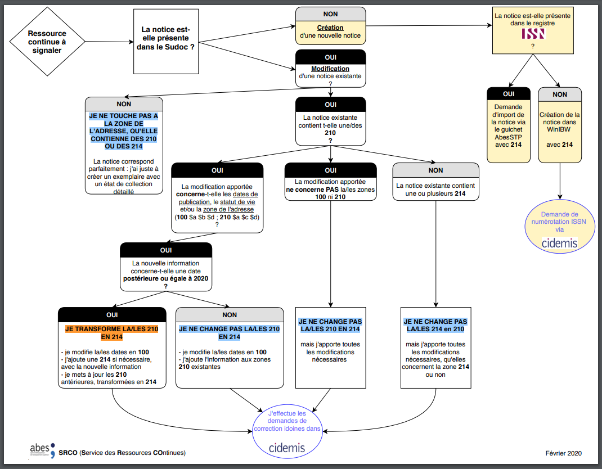

# Zone 214 : Mention de publication, production, diffusion, fabrication

## Descriptif de la zone

| Zone | Ind1 | Ind2 | Code de sous-zone | Position | Valeur | O/F | R/NR | Contenu | Table de valeurs associée |
| --- | --- | --- | --- | --- | --- | --- | --- | --- | --- |
| 214 |  |  |  |  |  | O | R | Mention de publication, production, diffusion, fabrication |  |
|  | # |  |  |  |  |  |  | Non applicable / Adresse d'origine (pour les ressources continues) |  |
|  | 0 |  |  |  |  |  |  | Adresse de départ ou intermédiaire (pour les ressources continues) |  |
|  | 1 |  |  |  |  |  |  | Adresse courante ou dernière adresse (pour les ressources continues) |  |
|  |  | # |  |  |  |  |  | Adresse bibliographique (livre ancien ou publication en série ancienne) |  |
|  |  | 0 |  |  |  |  |  | Mention de publication |  |
|  |  | 1 |  |  |  |  |  | Mention de production |  |
|  |  | 2 |  |  |  |  |  | Mention de diffusion / distribution |  |
|  |  | 3 |  |  |  |  |  | Mention de fabrication / impression |  |
|  |  | 4 |  |  |  |  |  | Date de copyright ou de protection |  |
|  |  |  | a |  |  | F | R | Lieu de publication / Lieu de production / Lieu de diffusion ou de distribution / Lieu de fabrication |  |
|  |  |  | b |  |  | F | R | Adresse de l'éditeur / Adresse du producteur / Adresse du diffuseur ou du distributeur / Adresse du fabricant |  |
|  |  |  | c |  |  | F | R | Nom de l'éditeur / Nom du producteur / Nom du diffuseur ou du distributeur / Nom du fabricant |  |
|  |  |  | d |  |  | F | R | Date de publication / Date de production / Date de diffusion ou de distribution / Date de fabrication / Date de copyright ou de protection |  |
|  |  |  | [r](https://documentation.abes.fr/sudoc/formats/unmb/zones/214.htm#$r) |  |  | F | NR | [Adresse entière prise à la page de titre](https://documentation.abes.fr/sudoc/formats/unmb/zones/214.htm#$r) |  |
|  |  |  | [s](https://documentation.abes.fr/sudoc/formats/unmb/zones/214.htm#$s) |  |  | F | NR | [Adresse entière prise au colophon ou à l'achevé d'imprimer](https://documentation.abes.fr/sudoc/formats/unmb/zones/214.htm#$s) |  |
|  |  |  | 6 |  |  | F | NR | [Données de lien entre zones (en cas écriture non latine)](https://documentation.abes.fr/sudoc/formats/unmb/zones/214.htm#$6Et7) |  |
|  |  |  | 7 |  |  | F | NR | [Informations codées sur l'écriture de catalogage des données de la zone](https://documentation.abes.fr/sudoc/formats/unmb/zones/214.htm#$6Et7) |  |
|  |  |  | P |  |  | F | NR |  |  |

| Les [$6 et $7](https://documentation.abes.fr/sudoc/formats/unmb/zones/214.htm#$6Et7) sont réservés au catalogage de documents comportant des caractères non latins. |
| --- |

## Principes généraux

La zone **214** reçoit les données relatives à l'adresse bibliographique (données saisies jusqu'en mars 2017 en zone [210](https://documentation.abes.fr/sudoc/formats/unmb/zones/210.htm) pour les notices hors ressources continues et jusqu'en décembre 2019 pour les notices de ressources continues) en conformité avec[RDA-FR](http://www.transition-bibliographique.fr/wp-content/uploads/2016/08/rda_fr_section1.pdf), aux paragraphes suivants :

- 2.7 Mention de production
- 2.8 Mention de publication
- 2.9 Mention de diffusion ou de distribution
- 2.10 Mention de fabrication
- 2.11 Date de copyright

Toutes les nouvelles notices bibliographiques doivent comporter au moins une **214** qui sera :

- une *mention de production* (**214** #*1*) dans le cas des ressources non publiées (travaux universitaires, manuscrits, épreuves corrigées, estampes avant la lettre, journaux clandestins, fanzines,......)

OU

- une *mention de publication* (**214** #*0*), dans le cas des ressources publiées, complétée d'une autre zone **214** pour apporter des précisions de dates nécessaires à l'identification de la ressource lorsque celles-ci manquent à la mention de publication.

### Transcriptions et abréviations

Les données sont transcrites telles qu'elles apparaissent sur la ressource. Elles ne doivent pas être abrégées par le catalogueur.

| Par exemple : |
| --- |
| **214** #0**$a**Monaco**$a**Marseille [etc.]*$cÉditions Alpen* |
| Commentaire : |
| Et non pas "Ed. Alpen" |

Abandon des locutions latines abrégées : [S.l.], [s.n.], [sic], [i.e.], remplacées dans les deux premiers cas par [Lieu de publication inconnu], [éditeur inconnu].

Concernant les sigles et acronymes, si les lettres sont séparées par des points, transcrire le sigle ou l'acronyme sans points, en ométtant tout espacement interne.

| Par exemple : |
| --- |
| **214** #0**$a**Paris*$cCNRS*$d1974 |
| Commentaire : |
| Et non pas "C.N.R.S." |

Se reporter aux règles de transcription publiées dans RDA-FR aux paragraphes suivants :

- 1.7: Transcription [règles générales]
- 1.8: Nombres exprimés en chiffres ou en toutes lettres
- 1.9: Dates

### Graphie erronée sur la ressource

En cas de mauvaise graphie sur la ressource (ex. : Galimard au lieu de Gallimard, Pris au lieu de Paris), la transcription doit être strictement conforme à la mention portée sur la ressource. Une note doit être ajoutée en [306](https://documentation.abes.fr/sudoc/formats/unmb/zones/306.htm) pour rectifier l'erreur et préciser la graphie correcte, accompagnée d'un point d'accès en 7X2 si la faute de graphie concerne le nom de l'éditeur, du diffuseur, du fabricant...

### Ressources non publiées

Champ d'application de la **mention de production**, (RDA-FR 2.7.1.1 Champ d'application) :

" Une mention de production est une mention identifiant le ou les lieux de production, le ou les producteurs et la ou les dates de production d'une ressource sous une forme non publiée (par exemple, un manuscrit, un dessin, un état d'estampe avant publication, un négatif photographique, un enregistrement produit localement, une vidéo institutionnelle, un document de littérature grise).

Les mentions de production comprennent les mentions relatives à l'inscription matérielle, l'enregistrement, la fabrication, la construction, etc. d'une ressource sous une forme non publiée. Toutefois, pour des ressources dont la fabrication nécessite des compétences techniques particulières, la mention de production peut être distincte de la mention de fabrication.

Enregistrer une mention de production dans les cas suivants :

- ressources sous forme non publiée (manuscrits originaux, lettres originales, dessins, tirages photographiques originaux, albums de photographies de famille, captations et enregistrements personnels, ressources numériques sous une forme brute mises en ligne sur une plate-forme, etc.)

- ressources qui ne sont pas, ou pas encore, dans un état publiable (documents préparatoires ou de travail : maquettes, épreuves corrigées ou non de texte ou de musique imprimée, états d'estampes avant publication, négatifs photographiques, matrices, etc.)

- ressources destinées à un usage privé ou restreint, que ce soit sous une forme publiable (vidéos institutionnelles, audiovisuel d'entreprise, etc.) ou sans forme particulière (littérature grise, rapports de recherche)

- thèses et autres travaux universitaires sous une forme non remaniée en vue d'une publication commerciale

- reproductions effectuées à la demande ou pour des besoins de sauvegarde par des institutions de conservation et non mises à la disposition de tous (microformes, copies sur papier, images numérisées non mises en ligne, etc.), si la politique de catalogage de l'établissement stipule de les décrire en tant que telles.

Les sites web (y compris les blogues et les sites personnels) sont considérés comme des ressources publiées.

Toutefois, si une ressource (par exemple, une vidéo institutionnelle) n'a pas de mention de publication, mais a une mention de diffusion ou de distribution qui atteste qu'elle a été mise à disposition du public, ne pas renseigner l'élément Mention de production, mais seulement l'élément Mention de diffusion ou de distribution"

Dans le cas de **ressources non publiées**, la zone **214** requise est celle mentionnant les données de production.

*L'indicateur 2 prend la valeur 1 : Mention de production*

| Zone | Ind1 | Ind2 | Code de sous-zone | Position | Valeur | O/F | R/NR | Contenu | Table de valeurs associée |
| --- | --- | --- | --- | --- | --- | --- | --- | --- | --- |
| 214 | # | 1 |  |  |  | O | R | Mention de production |  |
|  |  |  | a |  |  | F | R | Lieu de production |  |
|  |  |  | b |  |  | F | R | Adresse du producteur |  |
|  |  |  | c |  |  | F | R | Nom du producteur |  |
|  |  |  | d |  |  | F | R | Date de production |  |

+ sous-zones de liens entre données **$6/$7** si nécessaire dans le cas de notices en multi-écritures et/ou d'appariement.

| Par exemple : |
| --- |
| **200** 1#**$a**@Correspondance de George Sand et d'Alfred de Musset**$e**[Epreuves corrigées par le Vicomte de Lovenjoul] |
| *214 #1$a[Lieu de production inconnu]$c[producteur inconnu]$d[1904]* |

thèses et autres travaux universitaires (dans leurs versions de soutenance)

non publiées

(Voir ci-dessous le [paragraphe sur les thèses](https://documentation.abes.fr/sudoc/formats/unmb/zones/214.htm#219Theses)).

### Ressources publiées

**Quelle(s) mention(s) enregistrer ?**

Dans le cas de ressources publiées, il faut s'attacher à distinguer par ordre de priorité :

1. Les mentions de publication (ce qui inclut les mentions de dépôt légal) ;
2. Les mentions de diffusion/distribution ;
3. Les mentions de copyright (ou de protection pour les enregistrements sonores) ;
4. Les mentions de fabrication/impression.

Pour le champ d'application de la **mention de publication**, voir RDA-FR 2.8.1.1 *Champ d'application [de la mention de publication]*, mais aussi RDA-FR 2.7.1.1 *Champ d'application [de la mention de production]* qui donne des précisions sur certains types de ressources considérés comme des ressources publiées.

La zone **214** contient des informations sur la publication, la distribution (ou la diffusion), la fabrication (ou l'impression) et le copyright d'une ressource, en particulier les dates qui y sont associées.

La nature de ces informations est distinguée par la valeur de l'indicateur 2 de la zone **214** (Voir [Indicateurs](https://documentation.abes.fr/sudoc/formats/unmb/zones/214.htm#Indicateurs) ci-dessous).

- La zone **214** pour une mention de publication, de distribution (ou de diffusion) et de fabrication peut contenir l'adresse (lieu + nom, voir ci-dessous [$a / $b / $c](https://documentation.abes.fr/sudoc/formats/unmb/zones/214.htm#$a$b$c) et la date (voir ci-dessous [$d](https://documentation.abes.fr/sudoc/formats/unmb/zones/214.htm#$d)) ;
- La zone **214** pour une date de copyright et/ou de protection contient seulement des sous-zones de dates : date de copyright et date de protection pour les enregistrements sonores.  Si la date de copyright est identique à la date de protection, on saisit les deux dates dans une seule et même zone **214** #4 ([$dC $dP](https://documentation.abes.fr/sudoc/formats/unmb/zones/214.htm#$d)).

*Toutes les notices décrivant une ressource publiée doivent comporter au moins une mention de publication (zone 214 #0 $a + $c), même si les lieux de publication et noms de l'éditeur sont inconnus.*

| Par exemple : |
| --- |
| **214** #0*$a[Lieu de publication inconnu]$c[éditeur inconnu]* |
| **214** #2**$a**Paris**$c**Presses universitaires de France |
| **214** #4**$d**C 1990 |

Attention : pour les règles de catalogage des reproductions à l'identique et des versions remaniées et commercialisées de thèses, voir la [fiche dédiée au catalogage des thèses](https://documentation.abes.fr/sudoc/regles/Catalogage/Regles_Theses.htm#IMPRAdresse).

*Toutes les notices décrivant une ressource publiée doivent comporter au moins une date, même approximative, dans la zone 214 qui sera jugée la plus appropriée pour l'identification de la ressource.*

| Par exemple : |
| --- |
| **214** #0**$a**[Lieu de publication inconnu]**$c**[éditeur inconnu] |
| **214** #4*$dC 1980* |

**Adresse bibliographique**

L'adresse complète doit être enregistrée dans la sous-zone correspondante (**214 $b**) uniquement si elle est nécessaire à l'identification de la ressource (c'est-à-dire qu'on déduit le lieu ou le nom de l'éditeur/du distributeur/du fabricant d'après cette adresse complète). Elle inclut le nom de la ville (Voir RDA-FR, 2.8.4.3 / 2.9.4 / 2.10.4).

**Date d'une ressource publiée**

Il est obligatoire dans le Sudoc de fournir une date (ou une fourchette de dates) associée à la ressource.

**Mentions multiples sur la ressource publiée : choix de la date**

Si la ressource comprend une mention de publication *datée* complétée d'un achevé d'imprimer et/ou d'une mention de distribution et/ou d'un copyright, *seule est obligatoire la mention de publication datée (voir ci-dessus). Toutes les autres données sont facultatives*.

- **En cas de dates multiples sur la ressource, choisir dans cet ordre :**  la date de publication (sinon de dépôt légal) la date de diffusion ou de distribution la date de copyright la date de fabrication (ou d'achevé d'imprimer).       *la date de publication prime sur la date de dépôt légal.*     Une date de copyright ne doit être enregistrée dans la zone **214** que si elle est nécessaire à l'identification de la ressource, c'est-à-dire si et seulement si :  aucune date de publication, dépôt légal ou diffusion n'est présente  ET   la date du copyright correspond "à la date de mise à disposition de la manifestation décrite (RDA-FR 2.11.1.1)".     *La date de copyright saisie en 214 ne doit jamais être celle associée à une manifestation antérieure. Pour une date de copyright correspondant à l'expression contenue, voir zone 100 $f.*      Pour les informations relatives à la saisie des dates, voir, [$d](https://documentation.abes.fr/sudoc/formats/unmb/zones/214.htm#$d)     Cas particuliers :  Dans le cas des images animées publiées, lorsque la mention de diffusion / distribution est présente sur la ressource, l'enregistrer en complément de la mention de publication. Dans le cas des enregistrements sonores publiés, si la mention de diffusion / distribution peut être établie et si elle est utile à l'identification de la ressource, l'enregistrer en complément.

**Monographies et réimpressions successives**

Le principe de base dans le Sudoc est que l'on rédige une seule notice pour l'ensemble des tirages d'une édition donnée.

Note : Un " tirage revu et corrigé " est une nouvelle édition, donc, il faut créer une nouvelle notice.

Si l'on trouve deux notices correspondant à des tirages différents de la même édition, il faut les fusionner, garder la date la plus ancienne (en zone **214** et en zone [100](https://documentation.abes.fr/sudoc/formats/unmb/zones/100.htm)), et rédiger une note en zone [305](https://documentation.abes.fr/sudoc/formats/unmb/zones/305.htm) *pour signaler les dates des différents tirages*.

**Absence de date de publication sur la ressource**

- En l'absence de toute date sur la ressource, quelle qu'en soit la nature, on doit renseigner l'élément Date de publication par une date approximative entre [ ]. Voir règles de transcription des dates approximatives dans RDA-FR. 2.8.7.6.5 et 1.9.3, et ci-dessous au paragraphe [$d](https://documentation.abes.fr/sudoc/formats/unmb/zones/214.htm#$d).   Par exemple :   **214** #0**$a**[Lieu de publication inconnu]**$c**[éditeur inconnu]*$d[20..]*
- En l'absence de date de publication (ou de DL) sur la ressource mais présence d'une autre date, on transcrit :  la mention de publication **214 #0 $a $c** non datée en la complétant par une date d'une autre nature, choisie dans cet ordre :   une date de diffusion / distribution ; une date de copyright ou de protection ; une date fabrication / impression.       Par exemple :   **214** #0**$a**Paris**$c**Maxima-Laurent du Mesnil éditeur   **214** #4**$d**C 2017   Commentaire :  La mention de publication (**214** #*0*) est obligatoire, même sans date.  Elle est ici complétée par une seconde zone **214** contenant une date associée à la ressource selon les critères établis par la norme (date de copyright correspondant à la mise à disposition de la ressource).     Répétition de la zone 214  Cette répétition peut être nécessaire à l'identification de la manifestation. Elle permet de répondre aux objectifs suivants :   Dater la manifestation en l'absence de date de publication (voir ci-dessus). Distinguer les données de diffusion (ou de distribution), de fabrication et/ou de copyright, par rapport aux données de publication, selon les informations présentes sur la ressource, si on les juge utiles à l'identification de la manifestation. C'est la valeur de l'indicateur 2 qui permettra d'opérer ces distinctions. Distinguer plusieurs séquences successives de dates de publication, de distribution, de fabrication ou de copyright au lieu de les donner dans la note [306](https://documentation.abes.fr/sudoc/formats/unmb/zones/306.htm) sur l'adresse bibliographique, ou en complément de celle-ci. Voir [Publications échelonnées sur plusieurs années et ayant connu des changements éditoriaux](https://documentation.abes.fr/sudoc/formats/unmb/zones/214.htm#PublicationEchelonneeDansLeTemps)). Cette distinction est notamment obligatoire pour les ressources continues éditées successivement par des éditeurs différents, sans changement majeur de titre. Indexer l'ensemble des éditeurs, producteurs, diffuseurs et fabricants (dans le Sudoc, les sous-zones **214 $b et $c** sont indexées dans l'index EDI alors que la note [306](https://documentation.abes.fr/sudoc/formats/unmb/zones/306.htm) n'est pas indexée). Enregistrer les différentes formes des mentions relatives à l'adresse bibliographique pour les ressources en caractères non latins (voir [$6 Données de lien entre zones / $7 Informations codées sur l'écriture de catalogage des données de la zone](https://documentation.abes.fr/sudoc/formats/unmb/zones/214.htm#$6Et7)   Les sous-zones de date (**$d, $r** et **$s**) ne sont pas répétables à l'intérieur d'une même zone **214**. En cas de besoin, créer une nouvelle occurrence de zone.     haut de page    Indicateurs Indicateur 1 Pour les **monographies**, le premier indicateur de la zone **214** n'est pas défini et prend toujours la valeur *#*.  Pour les **ressources continues**, le premier indicateur est choisi en fonction de la chronologie éditoriale de la publication décrite :    Editeur Indicateur 1   Editeur, distributeur,...de départ ou du plus ancien fascicule catalogué ***** #   Editeur(s), distributeur(s),... intermédiaire(s) 0   Editeur, distributeur,... courant ou dernier éditeur, distributeur,... ou dernière mention d'édition, etc. connue 1    ***** Les informations de cette zone ne doivent être modifiées que si elles sont incorrectes ou si des fascicules antérieurs à celui qui a servi de base au catalogage de la ressource continue portent une information différente.  Indicateur 2 Le 2e indicateur est utilisé pour distinguer :    ind. 2 = 0 une mention de publication (ce qui inclut les mentions de dépôt légal) ind. 2 = 1 une mention de production (voir [Ressources non publiées](https://documentation.abes.fr/sudoc/formats/unmb/zones/214.htm#RessourcesNonPubliees)) ind. 2 = 2 une mention de diffusion / distribution ind. 2 = 3 une mention de fabrication / impression ind. 2 = 4 une date de copyright (ou de protection pour les enregistrements sonores) ind. 2 = # (voir [cas des livres anciens](https://documentation.abes.fr/sudoc/formats/unmb/zones/214.htm#LivreAncien))   *Indicateur 2 = 0 Mention de publication*   Zone Ind1 Ind2 Code de sous-zone Position Valeur O/F R/NR Contenu Table de valeurs associée   214 # 0    F R Mention de publication       a   F R Lieu de publication       b   F R Adresse de l'éditeur       c   F R Nom de l'éditeur       d   F R Date de publication    + sous-zones de liens entre données $6/$7 si nécessaire dans le cas de notices en multi-écritures et/ou d'appariement.    Par exemple :   **214** #0**$a**Paris**$c**Albin Michel**$d**1992       *Indicateur 2 = 2 Mention de diffusion / distribution*   Zone Ind1 Ind2 Code de sous-zone Position Valeur O/F R/NR Contenu Table de valeurs associée   214 # 2    F R Mention de diffusion / distribution       a   F R Lieu de diffusion / distribution       b   F R Adresse du diffuseur / distributeur       c   F R Nom du diffuseur / distributeur       d   F R Date de diffusion / distribution    + sous-zones de liens entre données $6/$7 si nécessaire dans le cas de notices en multi-écritures et/ou d'appariement.    Par exemple :   **214** #2**$a**Branoux-les-Taillades**$c**Onélia distribution**$d**2003       *Indicateur 2 = 3 Mention de fabrication*   Zone Ind1 Ind2 Code de sous-zone Position Valeur O/F R/NR Contenu Table de valeurs associée   214 # 3    F R Mention de fabrication       a   F R Lieu de fabrication       b   F R Adresse du fabricant       c   F R Nom du fabricant       d   F R Date de de fabrication    + sous-zones de liens entre données $6/$7 si nécessaire dans le cas de notices en multi-écritures et/ou d'appariement.    Par exemple :   **214** #3**$a**[Wasselonne]**$c**Ott imprimeurs**$d**1992       *Indicateur 2 = 4 Date de copyright ou de protection*   Zone Ind1 Ind2 Code de sous-zone Position Valeur O/F R/NR Contenu Table de valeurs associée   214 # 4    F R Date de copyright ou de protection       d   F R Date de copyright / Date de protection    + sous-zones de liens entre données $6/$7 si nécessaire dans le cas de notices en multi-écritures et/ou d'appariement. La date de copyright doit être précédée de l'initiale C[espace]. La date de protection doit être précédée de l'initiale P[espace]    Par exemple :   **214** #4**$d**C 2008   *pour une date de copyright © 2008*     **214** #4**$d**P 2019   *pour une date de protection ℗ 2019*    Si un enregistrement sonore porte une date de copyright et une date de protection identiques, on enregistre les deux dates dans une seule et même zone **214 #4** **sd**C **$d**P. Sinon, on retient la date la plus récente.    haut de page   Sous-zones $6 Données de lien entre zones $7 Informations codées sur l'écriture de catalogage des données de la zone Pour plus d'information, se reporter aux [Règles de catalogage des documents en écritures non latines](https://documentation.abes.fr/sudoc/regles/Catalogage/Regles_Multiecritures.htm).      haut de page    $a Lieu de publication / Lieu de production / Lieu de de diffusion ou de distribution / Lieu de fabrication $b Adresse de l'éditeur / Adresse du producteur / Adresse du diffuseur ou du distributeur / Adresse du fabricant $c Nom de l'éditeur / Nom du producteur / Nom du diffuseur ou du distributeur / Nom du fabricant  **Lieu** Il s'agit du nom du lieu (le plus souvent une ville) associé à celui de l'éditeur, du producteur, du diffuseur, du fabricant sur les sources principales d'information. Il doit être transcrit tel quel (voir paragraphe [Transcriptions et abréviations](https://documentation.abes.fr/sudoc/formats/unmb/zones/214.htm#Abreviations).  Un nom de ville peut être suivi d'une précision géographique (cf. RDA-FR, § 2.8.2.3 et 2.8.2.4).  Lorsque le lieu associé à l'édition de la ressource est inconnu et qu'il est impossible de le situer géographiquement, même au niveau de la région ou du pays, il faut inscrire "[Lieu de publication inconnu]". Si le lieu est rétabli à l'aide de sources externes au document, son nom est inscrit entre [...]. Inclure à la fois le nom de la localité (ville, municipalité etc.) et le nom de la ou des divisions administratives plus vastes (département, région, province, État, etc. et/ou pays) s'ils sont présents sur la source d'information. Les noms des États et provinces du Canada et des États-Unis ne sont plus abrégés, sauf si l'on retranscrit une abréviation présente sur la ressource décrite.  **Plusieurs lieux dans une même mention** Lorsque plusieurs lieux de publication, de production, de diffusion ou de fabrication sont présents sur la ressource, accompagnant la même mention relative à la publication, production, diffusion ou fabrication, on cite au moins le 1er lieu, en fonction de la typographie, sinon selon l'ordre de citation. Les omissions peuvent être signalées par [etc.].    Par exemple :   **214** #0**$a**Paris *[etc.]***$c**Senonevero   Commentaire :   sur la ressource, on trouve : Paris, Marseille      Il est également possible de citer tous les noms de lieux, selon leur ordre d'apparition dans la ressource.     Par exemple :   **214** #0*$aBerlin$aHeidelberg$aNew York***$c**Springer**$d**2004      S'il y a une ville française qui n'est pas le 1er lieu mentionné, on doit la citer en 2e position.   Par exemple :   **214** #0**$a**London*$aParis* [etc.]   Commentaire :   Sur la source d'information, on a : " London, New York, Roma, Paris ".      **Plusieurs lieux de publication associés à plusieurs éditeurs** Si la ressource comporte plusieurs noms d'éditeurs, on les transcrit tous, dans leur ordre d'apparition, dans une même zone **214**.  La séquence **$a $c** est répétée.    Par exemple :   **214** #0*$aParis$cÉditions du CNRS$aBudapest$cAkadémiai kiadó***$d**1982      haut de page   $d Date de publication / Date de production / Date de diffusion ou de distribution / Date de fabrication / Date de copyright / Date de protection  Transcription des dates  La date de dépôt légal doit être précédée de la mention DL.    Par exemple :   **214** #0**$d**DL 2017   La date de copyright doit être précédée de l'initiale C[espace]. La date de protection doit être précédée de l'initiale P[espace]    Par exemple :   **214** #4**$d**C 2008    *pour une date de copyright © 2018*     **214** #4**$d**P 2019   *pour une date de protection ℗ 2019*    *Aucune autre mention ne doit être utilisée pour qualifier une date.*   **Date incertaine ou restituée** Selon les principes généraux mis en oeuvre dans le Sudoc ([voir ci-dessus](https://documentation.abes.fr/sudoc/formats/unmb/zones/214.htm#DatePubliee)), on donne toujours une date, même approximative, pour la manifestation décrite. Dans le cas où aucune date relative à la manifestation n'est trouvée dans les sources principales d'information, il faut restituer une date (de publication) entre crochets grâce à d'autres sources d'information internes au document (contenu, typographie, support, mentions manuscrites, etc.) ou extérieures (bibliographies, etc.). Il est obligatoire de justifier cette date dans une note [306](https://documentation.abes.fr/sudoc/formats/unmb/zones/306.htm) (RDA-FR, § 2.8.7.6.5.2).   Par exemple :        **214** #0**$d**[2013] *date certaine restituée*  - En 306 : Publié en 2013 d'après le catalogue de l'éditeur       **214** #0**$d**[1854 ?] *date probable*  - En 306 : Publié probablement en 1854 d'après la préface       **214** #0**$d**[1971 ou 1972] *date connue pour être l’une ou l’autre de deux années consécutives*  - En 306 : Publié en 1971 ou 1972 d'après le texte       **214** #0**$d**[pas après le 21 août 2009] *La plus ancienne/récente date possible est connue : enregistrer 'pas avant'/'pas après' suivi de la date*  - En 306 : 21 août 2009 : date de première capture de la ressource dans les Archives de l'Internet       **214** #0**$d***[*199.*]* *décennie certaine*       **214** #0**$d***[*199.*?]* *décennie probable*       **214** #0**$d***[*19*..]* *siècle certain mais décennie inconnue*      *Ne pas utiliser de terme tel que "circa" ou "environ" pour les dates approximatives.*  Pour plus d'informations sur l'enregistrement d'une date restituée, voir RDA-FR 1.9.3.     haut de page   $r Adresse entière prise à la page de titre (livre ancien ou publication en série ancienne)  $s Adresse entière prise au colophon ou à l'achevé d'imprimer (livre ancien ou publication en série ancienne) Voir paragraphe [Cas des livres anciens](https://documentation.abes.fr/sudoc/formats/unmb/zones/214.htm#LivreAncien) ci-dessous.     haut de page    Cas particuliers **Cas de publications échelonnées sur plusieurs années et ayant connu des changements éditoriaux**  Une ressource dont la publication s'échelonne sur plusieurs années peut connaître différents intervenants qui auront chacun un rôle déterminé à un moment précis de sa vie éditoriale. Dans la description de la ressource, ces précisions sur les étapes successives de la vie éditoriale de la ressource doivent être conjuguées aux différents rôles mentionnés *si on juge ces données nécessaires à l'identification de la ressource*.    Par exemple :   **214** #0**$a**[Paris]**$c**P. Jannet**$d**1857   **214** #0**$a**[Paris]**$c**P. Daffis**$d**1877-1878   Commentaire :   Publication en 4 volumes ayant connu 1 changement d'éditeur   Premier volume publié par l'éditeur d'origine en 1857 ; Volume 2 à 4 publiés par un second éditeur respectivement en 1877 (volume 2) et en 1878 (volumes 3 et 4).  Dans cet exemple, chaque volume porte une mention de publication complète (lieu de publication + nom de l'éditeur + date de publication).        Par exemple :   **214** #0**$a**[Ville d'origine de l'édition]**$c**[Editeur d'origine]**$d**1979-1986   **214** #0**$a**[première ville intermédiaire d'édition]**$c**[Editeur intermédiaire]   **214** #4**$d**C 1987   **214** #0**$a**[Dernière ville d'édition connue ou en cours]**$c**[Dernier éditeur connu ou en cours]   **214** #4**$d**C 1999   Commentaire :   Publication en 5 volumes ayant connu 2 changements d'éditeur   Les 3 premiers volumes ont été publiés par l'éditeur d'origine entre 1979 et 1986 ; le 4e volume a été publié par un 2e éditeur (qualifié dans l'exemple d'éditeur intermédiaire). Il ne portait pas de date de publication mais une date de copyright était mentionnée ; de même pour le 5e volume, publié par un 3e éditeur.        haut de page   **Cas des thèses (modernes et anciennes)** Une mention de *production* (**214** #*1*) est obligatoire pour les thèses et autres travaux universitaires *non publiés et présentés dans leur version originelle (document de soutenance pour une thèse, par exemple)*.  La mention de production enregistrée ne contient que la date de production (**$d**)    Par exemple :   **200** 1#**$a**@Contribution à l'histoire de la pharmacie dans le Lyonnais (Lyon excepté)**$e**thèse présentée et soutenue publiquement le 20 juin 1949   *214 #1$d1949*    La date doit être rétablie entre [...] au cas où elle n'apparaît pas sur la ressource.  Pour les règles de catalogage des thèses anciennes, voir [la fiche dédiée au catalogage des thèses](https://documentation.abes.fr/sudoc/regles/Catalogage/Regles_Theses.htm#IMPRCasdesThesesAnciennes) Pour les règles de catalogage des reproductions à l'identique et des versions remaniées et commercialisées, voir [la fiche dédiée au catalogage des thèses](https://documentation.abes.fr/sudoc/regles/Catalogage/Regles_Theses.htm#IMPRAdresse)  haut de page   **Cas des livres anciens et des publications en série anciennes** *Indicateur 2 = # Adresse bibliographique (livre ancien)*   Zone Ind1 Ind2 Code de sous-zone Position Valeur O/F R/NR Contenu Table de valeurs associée   214 # #    F R Adresse bibliographique (livre ancien et publication en série ancienne)       r   F NR Adresse entière prise à la page de titre       s   F NR Adresse entière prise au colophon ou à l'achevé d'imprimer    + sous-zones de liens entre données $6/$7 si nécessaire dans le cas de notices en multi-écritures et/ou d'appariement.  L'indicateur 2 n'est pas défini dans le cas des livres anciens. La sous-zone **$r (adresse entière prise à la page de titre)** et la sous-zone **$s (adresse entière prise au colophon ou à l'achevé d'imprimer)** sont dédiées à la description du livre ancien et saisies dans une zone **214 ##**.  Ces sous-zones sont utilisées pour transcrire l'adresse telle qu'elle se présente sur une des trois sources d'information principales pour ce type de document.  L'utilisation de l'une ou l'autre de ces deux sous-zones (**214 ##**) est exclusive de l'usage de toute autre mention (**214** avec autre valeur de l'indicateur 2).  Les sous-zones **$r** et **$s** sont utilisées conjointement lorsqu'une adresse figure à la fois en page de titre et au colophon (ou à l'achevé d'imprimer).    Par exemple   **214** ##**$r**A Paris, chez Masson, libraire, rue Gallande, n° 27. An IX de la République [1800 ou 1801]**$s**De l'imprimerie de Richard, place Cambrai, n° 4.       haut de page   Cas des reproductions ou fac-similés Dans le cas de reproduction ou de fac-similé, les mentions à citer dans le(s) zone(s) **214** sont celles relatives à la reproduction ou au fac-similé. Une note complémentaire doit être ajoutée en [324](https://documentation.abes.fr/sudoc/formats/unmb/zones/324.htm) pour donner les informations sur la manifestation originale, dont la date est également à signaler en [100 $e](https://documentation.abes.fr/sudoc/formats/unmb/zones/100.htm).    Par exemple   **100** 0#*$a2007**$e1865*   **200** #1**$a**@Bogdan Chmielnicki**$f**Prosper Mérimée   **214** #0**$a**Paris**$c**L'Harmattan*$dDL 2007*   *324 ##$aFac-similé extrait du recueil "Les Cosaques d'autrefois" publié à Paris : M. Lévy frères, 1865*       haut de page  Cas des monographies électroniques Pour les monographies électroniques, la notion du diffuseur est tout ausi importante que celle de l'éditeur commercial : il se peut que le même titre soit diffusé par une ou plusieurs plateformes, à des dates différentes, simultanément ou non à la publication par l'éditeur commercial. Il se peut également que l'éditeur commercial soit également le diffuseur. Les consignes d'application de la zone sont donc les suivantes :  enregistrer la mention de publication (lieu et nom de l'éditeur commercial), sans la date enregistrer la mention de diffusion, en complément de la mention de publication enregistrer seulement la date de diffusion.      Par exemple :   **200** 1#**$a**Tenir parole**$e**responsabilités des métiers de la transmissions**$f**Mireille Cifali   **214** #0**$a**Paris**$c**PUF   **214** #2**$a**Paris**$c**Cairn**$d**2022   Commentaire :  Ce titre, dont la manifestation imprimée a été publiée chez PUF en 2020, est mis en ligne et diffusé par Cairn en 2022.   Pour plus de précisions, consulter les [Règles de Catalogage de monographies électroniques](https://documentation.abes.fr/sudoc/regles/Catalogage/Regles_MonographieElectronique.htm).    haut de page  Si la 214 est appliquée aux RC, supprier ce chapitre mais demander au moins un exemple aux RC Cas des ressources continues Généralités d'utilisation de la zone Les ressources continues sont susceptibles de présenter, dans le courant de leur existence, plusieurs mentions différentes d'éditeur, de distributeur/diffuseur ou de fabricant. Chacune de ces mentions justifie, *type de responsabilité par type de responsabilité*, la création de plusieurs « blocs » de zones 214 correspondant aux éditeurs, etc. successifs de la publication. Chaque changement d'éditeur, etc. justifie de la création d'une nouvelle zone 214. La première zone 214 donne la date d'origine lorsque la publication est vivante et les dates extrêmes lorsqu'elle a cessé de paraitre. Seule la première zone 214 contenant, s'ils sont connus, le nom de l'éditeur et le lieu d'édition, et les dates de parution extrêmes de la publication, est pour part sous autorité ISSN. Toute modification des sous zones $a et $c de cette zone doit faire l'objet d'une demande de correction dans Cidemis. **La saisie des informations relatives à l'éditeur doit être préférée à la saisie d'informations portant sur les distributeurs/diffuseurs ou les fabricants**. Cependant, dans le cas où aucune information n'a pu être trouvée sur l'éditeur, il faut saisir les informations disponibles concernant (par ordre de préférence) les distributeurs/diffuseurs, les fabricants, ou, à défaut, des informations de date relatives au copyright ou aux droits de propriété, *en plus de la zone 214 obligatoire indiquant que ni le nom de l'éditeur ni le lieu d'édition ne sont connus*. Pour le cas de [ressources non publiées](https://documentation.abes.fr/sudoc/formats/unmb/zones/214.htm#RessourcesNonPubliees), la saisie d'une mention de production est préconisée.  Quand faut-il utiliser des zones 214 ? Quand faut-il conserver et utiliser des zones [210](https://documentation.abes.fr/sudoc/formats/unmb/zones/210.htm) ? Le caractère forcément évolutif des notices bibliographiques de ressources continues (au minimum : création de la notice ; modification de la notice quand la publication est terminée) fait qu'une même notice bibliographique, créée antérieurement à la mise en production de la zone 214, peut devoir être modifiée postérieurement à cette mise en production en janvier 2020. Le souci de ménager dans la production de notices bibliographiques de ressources continues des strates identifiables d'application de règles spécifiques en vue des modifications de format à venir liées à la Transition bibliographique a amené à proposer des règles spécifiques imposant, selon les cas, l'utilisation de la nouvelle zone 214 ou le maintien et l'ajout de la zone [210](https://documentation.abes.fr/sudoc/formats/unmb/zones/210.htm) . De ce fait, les zones [210](https://documentation.abes.fr/sudoc/formats/unmb/zones/210.htm) et 214 sont destinées, tant que la transition bibliographique ne sera pas achevée, non pas au sein d'une même notice, mais entre notices appartenant à des strates chronologiques de production différentes. Pour illustrer les règles à appliquer, ci-dessous :  un « arbre de décision » prenant en compte les différents cas de figure rencontrés (modification ou création d'une notice, zone concernée par la modification, etc.) ; un tableau récapitulant les cas où il faut, ou non, créer une ou des zones 214 ou convertir, ou non, des zones [210](https://documentation.abes.fr/sudoc/formats/unmb/zones/210.htm) existantes en zones 214.   Arbre de décision :   Tableau récapitulatif : On crée une ou plusieurs zones 214 uniquement dans les deux cas suivants :  création d'une **nouvelle notice** dans le Sudoc. modification d'une notice existante dans le Sudoc portant sur la zone de dates en 100 ou en [210](https://documentation.abes.fr/sudoc/formats/unmb/zones/210.htm) $d quand **une des dates concernées par la modification est supérieure ou égale à 2020**.  Dans tous les autres cas :  si présence d'une ou plusieurs [210](https://documentation.abes.fr/sudoc/formats/unmb/zones/210.htm) : on laisse les [210](https://documentation.abes.fr/sudoc/formats/unmb/zones/210.htm) existantes, on ajoute une ou plusieurs [210](https://documentation.abes.fr/sudoc/formats/unmb/zones/210.htm) . si présence d'une ou plusieurs 214 : on laisse les 214 existantes, on ajoute une ou plusieurs 214.     Quelques exemples commentés d'utilisation de la zone 214 :    Exemple 1 :   **214** #0**$a**Paris**$c**Maisonneuve et Larose**$d**1945-1979   Commentaire :   *La publication a cessé de paraître et a eu le même éditeur pendant toute sa durée de parution . La notice a été créée postérieurement à la mise en production de la zone 214 dans le Sudoc.*       Exemple 2 :   **214** #0**$a**Cambridge, MN**$c**Adams Publishing Group of East Central Minnesota**$c**ECM Publishers**$d**2019-   Commentaire :   *La publication est co-publiée depuis sa création, et continue à paraître. La notice a été créée postérieurement à la mise en production de la zone 214 dans le Sudoc.*      Exemple 3 : mention d'éditeurs pour une publication ayant changé d'éditeur sans changer d'ISSN   **214** #0**$a**Cambridge, MN**$c**Adams Publishing Group of East Central Minnesota**$d**2016-   **214** 00**$a**Cambridge, MN**$c**Adams Publishing Group of East Central Minnesota**$d**2016-2018   **214** 10**$a**Cambridge, MN**$c**ECM Publishers]**$d**2020-   Commentaire :   *La publication, créée en 2016 et continuant à paraître, a changé d'éditeur en 2020.*      **214** #0**$a**Saint-Denis**$c**Chambre d'agriculture de la Réunion**$d**2001-2007   **214** 00**$a**Saint-Denis**$c**Chambre d'agriculture de la Réunion**$d**2001-2003   **214** 10**$a**Saint-Denis**$c**Chambre de commerce**$d**2004-2007   Commentaire :   *La première mention d'édition indique la période (de début et de fin) de la publication sans tenir compte du changement d'éditeur, même si celle-ci ne correspond pas aux dates effectives de publication par l'éditeur mentionné. C'est la seule zone « sous autorité ISSN » pouvant faire l'objet d'une demande de correction. La notice a été créée postérieurement à la mise en production de la zone 214 dans le Sudoc.*      Exemple 4 : mentions de diffuseur quand l'éditeur n'est pas connu.   **214** #0**$a**[Lieu de publication inconnu]**$c**[éditeur inconnu]   **214** 02**$a**Cambridge, MN**$c**Adams Publishing Group of East Central Minnesota**$d**2014-2019    **214** 12**$a**Cambridge, MN**$c**ECM Publishers]**$d**2020-   Commentaire :   *L'éditeur de la publication n'est pas connu, il faut donc inclure les éléments d'information disponibles sur son diffuseur. La publication a été diffusée par un premier diffuseur, puis un second à partir de 2020, et continue à paraître.*      haut de page     Zone 211      Zone 215
